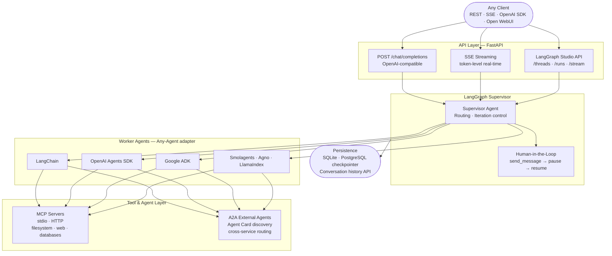

<div align="center">

# AgentWeave

### Docker Compose for AI agents.

**Define your entire multi-agent system in YAML — supervisor, workers, tools, LLMs, routing —  
and get a production REST API with streaming, human-in-the-loop, and OpenAI compatibility out of the box.**

[](https://python.org)
[](https://github.com/langchain-ai/langgraph)
[](https://modelcontextprotocol.io)
[](https://google.github.io/A2A/)
[](https://fastapi.tiangolo.com)
[](https://platform.openai.com/docs/api-reference)
[](LICENSE)

</div>

---

## The Concept

Docker Compose let you define a multi-service application in YAML and bring it up with one command — no code, no glue, just configuration. AgentWeave does the same for AI agent systems.

| Docker Compose | AgentWeave |
|---------------|------------|
| Define services in YAML | Define agents in YAML |
| Any container image | Any LLM framework (LangChain, OpenAI, Google ADK…) |
| Service networking | A2A agent-to-agent routing |
| Volume mounts | MCP tool servers |
| `docker compose up` | `agentweave serve --config config.yaml` |

A single YAML file describes your LLMs, tool servers, agents, routing rules, and API settings. The runtime wires everything together — framework adapters, MCP tool mounting, A2A agent discovery, SSE streaming, HITL pausing — so you never touch the orchestration code.

**Add an agent:** one YAML block. **Switch LLM:** one line. **Add a tool server:** two lines.

---

## 30-Second Demo

```yaml
# config.yaml — a research + writing agent team
llms:
  fast:
    provider: anthropic
    model: claude-haiku-4-5-20251001
    api_key_env: ANTHROPIC_API_KEY

mcp_servers:
  web:
    transport: stdio
    command: ["npx", "-y", "@modelcontextprotocol/server-brave-search"]

agents:
  supervisor:
    kind: supervisor
    llm: fast
    system_prompt: "Route research tasks to researcher, writing tasks to writer."

  researcher:
    kind: native_worker
    llm: fast
    framework: langchain        # swap to openai, google_adk, smolagents, agno…
    skills: [search_web]
    system_prompt: "Search the web and summarise your findings."

  writer:
    kind: native_worker
    llm: fast
    framework: langchain
    system_prompt: "Write polished documents from research notes."

serving:
  api:
    port: 7777
```

```bash
pip install agentweave
agentweave serve --config config.yaml
# → REST + SSE streaming API live at http://localhost:7777
# → OpenAI-compatible endpoint at /v1/chat/completions
```

---

## Architecture



---

## How It Works

### 1. Config is the only interface

Every piece of the system — LLMs, tool servers, agents, graph behaviour, API settings — lives in one YAML file. The runtime reads it at startup and wires everything together. Changing the config and restarting is the only operation needed to change the system.

### 2. Framework-agnostic workers via Any-Agent

Each worker agent declares a `framework` field. The Any-Agent adapter normalises tool calls, streaming, and message formats across 7+ frameworks so the supervisor never knows which framework a worker runs on.

| Framework | `framework:` value |
|-----------|--------------------|
| LangChain | `langchain` |
| OpenAI Agents SDK | `openai` |
| Google ADK | `google_adk` |
| Smolagents | `smolagents` |
| TinyAgent | `tiny_agent` |
| Agno | `agno` |
| LlamaIndex | `llama_index` |

### 3. MCP for tools, A2A for agents

Tools mount via the **Model Context Protocol** — any MCP server works with two config lines. External agents advertise via **Agent Cards** over the **A2A protocol** and are discovered automatically; the supervisor routes to them exactly like local workers.

### 4. Human-in-the-loop via graph interrupts

When the supervisor needs clarification it calls `send_message`, pausing the graph at the current step. The LangGraph checkpointer preserves all state. The API caller resumes the run with the user's answer — execution continues exactly where it left off.

---

## Tech Stack

| Layer | Technology | Why |
|-------|-----------|-----|
| **Orchestration** | LangGraph Supervisor | Stateful routing loop, built-in HITL tooling |
| **Agent runtime** | Any-Agent | 7+ frameworks behind one normalised interface |
| **Tool standard** | MCP (stdio + HTTP) | Vendor-neutral, growing ecosystem |
| **Agent interop** | A2A protocol | Cross-service agent discovery and routing |
| **API** | FastAPI + SSE | Async, streaming, OpenAI-compatible |
| **Persistence** | SQLite / PostgreSQL | LangGraph checkpointer for conversation state |
| **Config** | YAML DSL | Zero-code agent system definition |
| **LLM providers** | OpenAI · Anthropic · Google · Ollama · Azure | Swap via one config line |

---

## API at a Glance

```bash
curl -X POST http://localhost:7777/chat/completions \
  -H "Content-Type: application/json" \
  -d '{
    "messages": [{"role": "user", "content": "Research the latest AI agent papers"}],
    "stream": false
  }'
```

```json
{
  "id": "run_abc123",
  "choices": [{
    "message": {
      "role": "assistant",
      "content": "Here are the key findings from recent AI agent research..."
    }
  }],
  "model": "agentweave/supervisor",
  "usage": { "total_tokens": 1842 }
}
```

**OpenAI-compatible** — point Open WebUI, LangGraph Studio, or your own client at `http://localhost:7777` without any changes.

---

## Key Engineering Decisions

- **YAML as the only interface** — all framework glue, tool wiring, and routing logic is generated from config at startup. Operators never touch Python; developers extend by adding config keys, not editing orchestration code.
- **Any-Agent adapter pattern** — a thin normalisation layer translates each framework's tool-call and streaming format into a common interface. The supervisor is framework-blind; workers are hot-swappable without touching the graph.
- **MCP over custom tool SDKs** — the Model Context Protocol gives a single integration point for any tool server. Adding a capability means spinning up an MCP server and writing two lines of config.
- **A2A for horizontal agent composition** — external agents advertise themselves via Agent Cards. AgentWeave discovers them at startup and treats them as first-class workers, enabling multi-service agent pipelines with no shared code.
- **LangGraph checkpointer for HITL** — conversation state is persisted at each graph step. Pausing for human input is a native graph interrupt; resumption reloads state from the checkpointer and continues exactly where it left off.
- **OpenAI-compatible API surface** — exposing `/v1/chat/completions` means zero client changes when adopting AgentWeave. The supervisor's routing is completely transparent to the caller.

---

## Quick Start

```bash
# Install
pip install agentweave
pip install 'any-agent[langchain,openai]'   # add frameworks you need

# Configure
cp config.example.yaml config.yaml
# Edit config.yaml — set LLM provider and API key env vars

# Serve
agentweave serve --config config.yaml

# Develop (hot reload)
agentweave serve --config config.yaml --reload
```

---

## Project Structure

```
agentweave/
├── agentweave/
│   ├── api/          # FastAPI routes — chat, threads, runs, health
│   ├── graph/        # LangGraph supervisor + node definitions
│   ├── agents/       # Any-Agent worker adapter layer
│   ├── mcp/          # MCP server lifecycle + tool registry
│   ├── a2a/          # A2A agent discovery + routing
│   ├── llm/          # Multi-provider LLM client
│   ├── config/       # YAML config loader + Pydantic schemas
│   ├── skills/       # Tool grouping (tools → skills → skillsets)
│   └── tools/        # Tool binding and MCP bridge
├── docs/             # Architecture docs — C4 diagrams, API specs, data models
├── config.example.yaml
└── pyproject.toml
```

---

## Documentation

| Doc | Contents |
|-----|----------|
| [Executive Summary](docs/D01-executive-summary.md) | What AgentWeave is and what problem it solves |
| [Architecture Vision](docs/D02-architecture-vision-and-goals.md) | Design goals and principles |
| [System Context (C4 L1)](docs/D04-system-context-diagram-c4-l1.md) | High-level context diagram |
| [Container Diagram (C4 L2)](docs/D05-container-diagram-c4-l2.md) | Service and container breakdown |
| [Config Reference](docs/D26-config-reference-guide.md) | Every YAML key with defaults |
| [Config Examples](docs/D27-config-examples-catalog.md) | Ready-to-use config templates |
| [API Specifications](docs/D29-D33-api-interface-specifications.md) | All endpoints with request/response shapes |
| [Sequence Diagrams](docs/D34-D44-sequence-and-state-diagrams.md) | Request flows and state transitions |
| [Data Models](docs/D45-D50-data-models.md) | Pydantic schemas for all boundaries |
