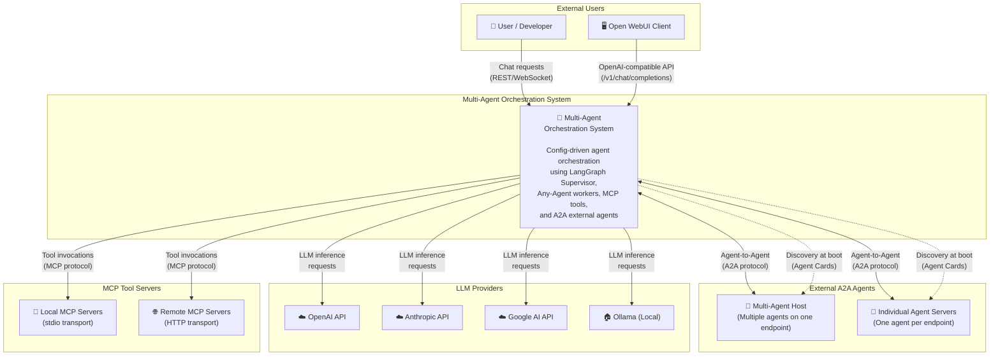
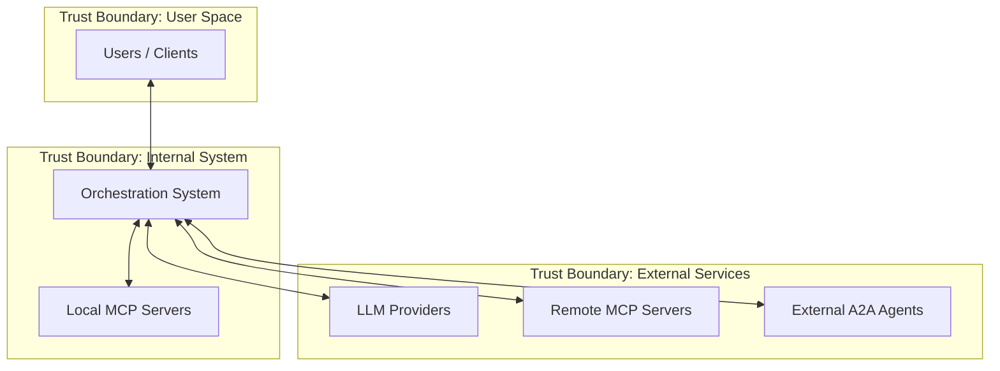

# D04: System Context Diagram (C4 Level 1)

## Config-Driven Multi-Agent Orchestration System

**Document ID:** D04  
**Version:** 1.0  
**Status:** Draft  
**Last Updated:** January 2026

---

## 1. Overview

This document presents the C4 Level 1 (System Context) diagram for the Multi-Agent Orchestration System. It shows the system as a single box and its relationships with external actors and systems.

---

## 2. System Context Diagram



---

## 3. Context Elements

### 3.1 The System

| Element | Description |
|---------|-------------|
| **Multi-Agent Orchestration System** | The system being designed. A config-driven orchestration layer that uses LangGraph Supervisor to coordinate native workers (via Any-Agent) and external agents (via A2A), with tools exposed through MCP. |

### 3.2 External Users

| Actor | Description | Interaction |
|-------|-------------|-------------|
| **User / Developer** | Human users interacting via chat interface or API | Send chat requests, receive responses, provide clarification when prompted |
| **Open WebUI Client** | Third-party chat interface compatible with OpenAI API format | Connects via OpenAI-compatible endpoint for seamless integration |

### 3.3 External Systems

| System | Description | Protocol | Direction |
|--------|-------------|----------|-----------|
| **OpenAI API** | Commercial LLM provider | HTTPS REST | Outbound |
| **Anthropic API** | Commercial LLM provider (Claude) | HTTPS REST | Outbound |
| **Google AI API** | Commercial LLM provider (Gemini) | HTTPS REST | Outbound |
| **Ollama (Local)** | Self-hosted LLM runtime, OpenAI-compatible | HTTP REST | Outbound |
| **Local MCP Servers** | Tool servers running locally | MCP over stdio | Outbound |
| **Remote MCP Servers** | Tool servers running remotely | MCP over HTTP/SSE | Outbound |
| **Multi-Agent Host** | Single endpoint serving multiple A2A agents | A2A (JSON-RPC) | Bidirectional |
| **Individual Agent Servers** | Standalone A2A agent endpoints | A2A (JSON-RPC) | Bidirectional |

---

## 4. Key Interactions

### 4.1 User Interaction Flow

```
User → REST API → System → Process → Response → User
```

1. User sends chat message via REST API or WebSocket
2. System processes through LangGraph Supervisor
3. Supervisor routes to appropriate worker(s)
4. Response streams back to user (when supported)

### 4.2 LLM Provider Interaction

```
System → LLM Provider → Inference Result → System
```

- System selects provider based on agent configuration
- Supports provider-specific and OpenAI-compatible endpoints
- Per-agent LLM override capability

### 4.3 MCP Tool Interaction

```
Worker → MCP Client → MCP Server → Tool Result → Worker
```

- Native workers invoke tools via MCP protocol
- stdio transport for local, HTTP for remote
- Tool results flow back to worker for processing

### 4.4 A2A External Agent Interaction

```
System → A2A Client → External Agent → A2A Response → System
```

- Boot-time: Discovery via Agent Cards
- Runtime: Task delegation via A2A protocol
- Supports both multi-agent hosts and individual servers

---

## 5. Trust Boundaries



| Boundary | Components | Security Consideration (Future) |
|----------|------------|--------------------------------|
| Internal System | Orchestration System, Local MCP | Highest trust, direct process communication |
| External Services | LLMs, Remote MCP, A2A Agents | Medium trust, require auth tokens |
| User Space | Users, Clients | Lowest trust, require authentication |

**Note:** Security implementation deferred for prototype; boundaries identified for future hardening.

---

## 6. Data Flows Summary

| Flow | Data | Protocol | Security (Future) |
|------|------|----------|-------------------|
| User → System | Chat messages, context | REST/WebSocket | API key, session |
| System → LLM | Prompts, conversation history | HTTPS | API key |
| System → MCP (local) | Tool calls, parameters | stdio | Process isolation |
| System → MCP (remote) | Tool calls, parameters | HTTPS/SSE | API key, mTLS |
| System ↔ A2A | Tasks, results, Agent Cards | HTTPS/JSON-RPC | Bearer token (future) |

---

## 7. Constraints at Context Level

| Constraint | Description |
|------------|-------------|
| **Single Instance** | Prototype runs as single instance; no clustering |
| **Boot-Time Discovery** | External agents discovered at startup only |
| **Config-Driven** | All integrations defined in configuration |
| **Protocol Compliance** | MCP and A2A standard compliance required |

---

## 8. Related Documents

- D03: Glossary & Terminology
- D05: Container Diagram (C4 Level 2)
- D07: Data Flow Architecture

---

## 9. Revision History

| Version | Date | Author | Changes |
|---------|------|--------|---------|
| 1.0 | Jan 2026 | Architecture Team | Initial draft |
