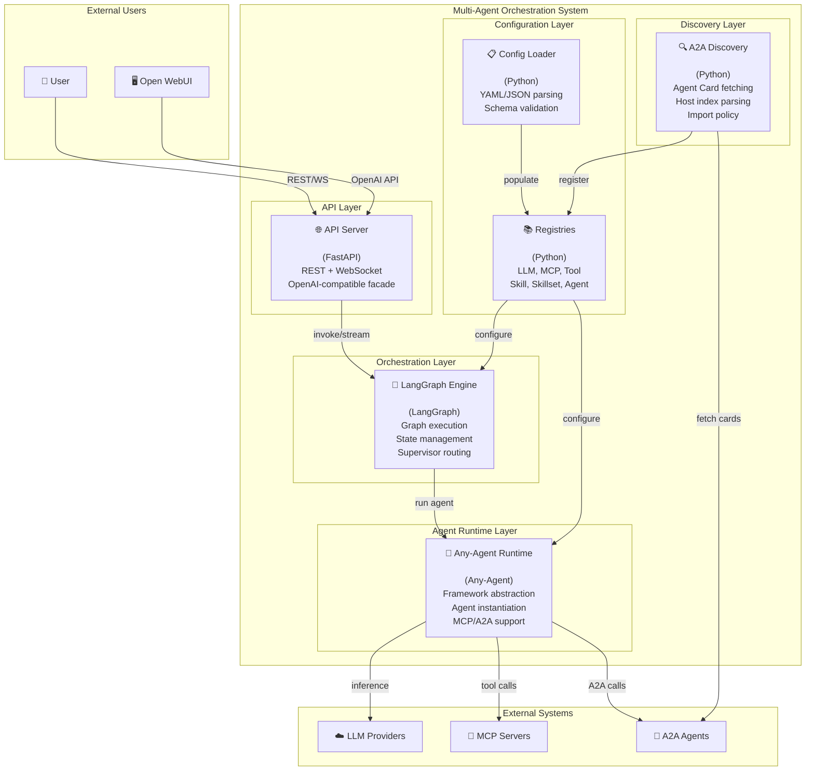
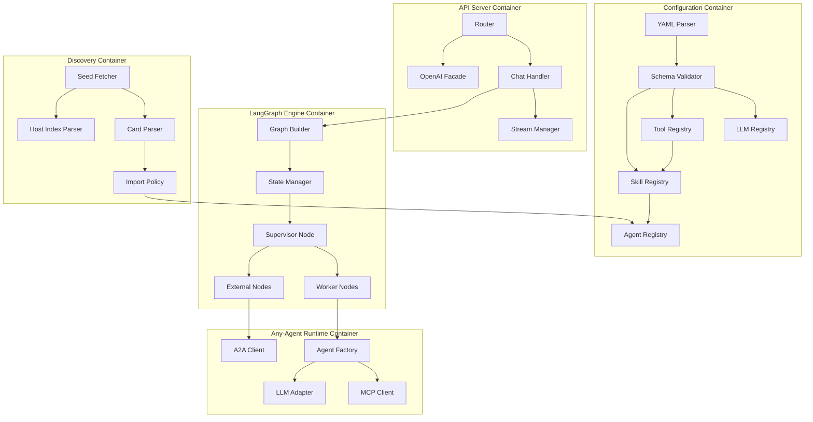
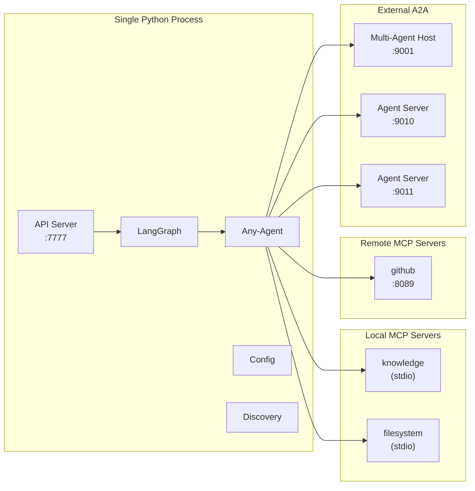

# D05: Container Diagram (C4 Level 2)

## Config-Driven Multi-Agent Orchestration System

**Document ID:** D05  
**Version:** 1.0  
**Status:** Draft  
**Last Updated:** January 2026

---

## 1. Overview

This document presents the C4 Level 2 (Container) diagram, decomposing the Multi-Agent Orchestration System into its major runtime containers and showing their interactions.

---

## 2. Container Diagram

---

## 3. Container Descriptions

### 3.1 API Layer

| Container | Technology | Responsibility |
|-----------|------------|----------------|
| **API Server** | FastAPI (Python) | HTTP request handling, WebSocket support, streaming responses, OpenAI-compatible facade endpoint |

**Key Endpoints:**
- `POST /chat` — Primary chat interface, invokes LangGraph
- `GET /agents` — List available workers and external agents
- `GET /health` — Health check endpoint
- `POST /v1/chat/completions` — OpenAI-compatible facade

**Interfaces:**
- Inbound: REST, WebSocket, SSE
- Outbound: LangGraph invocation

### 3.2 Orchestration Layer

| Container | Technology | Responsibility |
|-----------|------------|----------------|
| **LangGraph Engine** | LangGraph (Python) | Graph definition, state management, supervisor routing loop, conditional edge evaluation |

**Key Capabilities:**
- Compiles supervisor + worker nodes into executable graph
- Manages state (messages, task, context, results)
- Routes based on supervisor decisions
- Handles iteration limits and termination

**Interfaces:**
- Inbound: API Server invocations
- Outbound: Agent Runtime calls

### 3.3 Agent Runtime Layer

| Container | Technology | Responsibility |
|-----------|------------|----------------|
| **Any-Agent Runtime** | Any-Agent (Python) | Framework-agnostic agent instantiation, MCP tool integration, A2A communication |

**Key Capabilities:**
- Instantiates agents across frameworks (langchain, openai, google, etc.)
- Connects to MCP servers for tools
- Invokes external A2A agents
- Manages agent lifecycle

**Interfaces:**
- Inbound: LangGraph node execution
- Outbound: LLM providers, MCP servers, A2A agents

### 3.4 Configuration Layer

| Container | Technology | Responsibility |
|-----------|------------|----------------|
| **Config Loader** | Python + Pydantic | YAML/JSON parsing, schema validation, config object creation |
| **Registries** | Python (dict-based) | Runtime storage for instantiated LLMs, tools, skills, skillsets, agents |

**Registry Types:**
- `LLMRegistry` — Provider clients by config name
- `MCPRegistry` — MCP server connections
- `ToolRegistry` — Materialized tool objects
- `SkillRegistry` — Tool groupings
- `SkillsetRegistry` — Skill groupings
- `AgentRegistry` — Instantiated agents (native + external)

### 3.5 Discovery Layer

| Container | Technology | Responsibility |
|-----------|------------|----------------|
| **A2A Discovery** | Python + httpx | Fetches Agent Cards from seed URLs, parses host indices, applies import policies |

**Key Capabilities:**
- Fetches `/.well-known/agent.json` from individual agents
- Fetches `/a2a/index.json` from multi-agent hosts
- Applies include/exclude filters
- Registers discovered agents in AgentRegistry

---

## 4. Container Interaction Matrix

| From → To | Interaction | Protocol/Method |
|-----------|-------------|-----------------|
| User → API Server | Chat request | HTTP POST/WebSocket |
| API Server → LangGraph | Invoke graph | Python function call |
| LangGraph → Any-Agent | Execute agent node | Python function call |
| Any-Agent → LLM Provider | Inference request | HTTPS REST |
| Any-Agent → MCP Server | Tool invocation | MCP (stdio/HTTP) |
| Any-Agent → A2A Agent | Task delegation | A2A (JSON-RPC) |
| Config Loader → Registries | Populate | Python dict operations |
| Registries → Any-Agent | Provide config | Python object access |
| A2A Discovery → A2A Agent | Fetch Agent Card | HTTP GET |
| A2A Discovery → Registries | Register agent | Python dict operations |

---

## 5. Detailed Container Diagram with Internal Flow

---

## 6. Technology Stack per Container

| Container | Primary Tech | Dependencies |
|-----------|--------------|--------------|
| API Server | FastAPI 0.100+ | uvicorn, pydantic, sse-starlette |
| LangGraph Engine | LangGraph 0.2+ | langgraph-supervisor, langchain-core |
| Any-Agent Runtime | Any-Agent 1.14+ | Framework extras (langchain, openai, etc.) |
| Config Loader | Pydantic 2.0+ | PyYAML, jsonschema |
| Registries | Python stdlib | typing, dataclasses |
| A2A Discovery | httpx | a2a-sdk (optional) |

---

## 7. Deployment View

**Note:** Prototype runs as single process. MCP servers may be subprocesses (stdio) or separate services (HTTP).

---

## 8. Scaling Considerations (Future)

| Container | Scaling Strategy |
|-----------|------------------|
| API Server | Horizontal (multiple instances behind load balancer) |
| LangGraph Engine | Stateless per-request; horizontal scaling |
| Any-Agent Runtime | Embedded in LangGraph; scales with it |
| Registries | Read-heavy; cache or replicate |
| A2A Discovery | Boot-time only; no runtime scaling needed |

**Not in Prototype Scope:** Clustering, distributed state, persistent storage.

---

## 9. Related Documents

- D04: System Context Diagram (C4 Level 1)
- D06: Component Overview (C4 Level 3)
- D09: Technology Stack & Rationale

---

## 10. Revision History

| Version | Date | Author | Changes |
|---------|------|--------|---------|
| 1.0 | Jan 2026 | Architecture Team | Initial draft |
