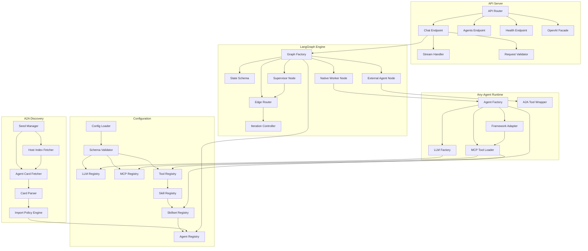
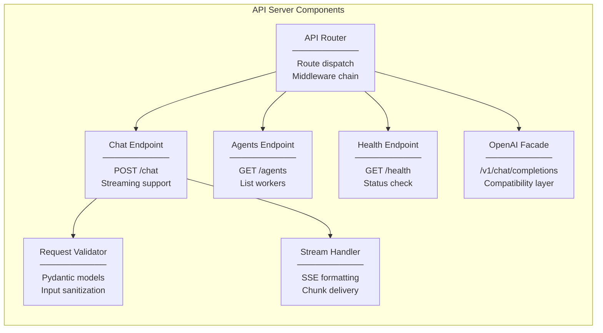
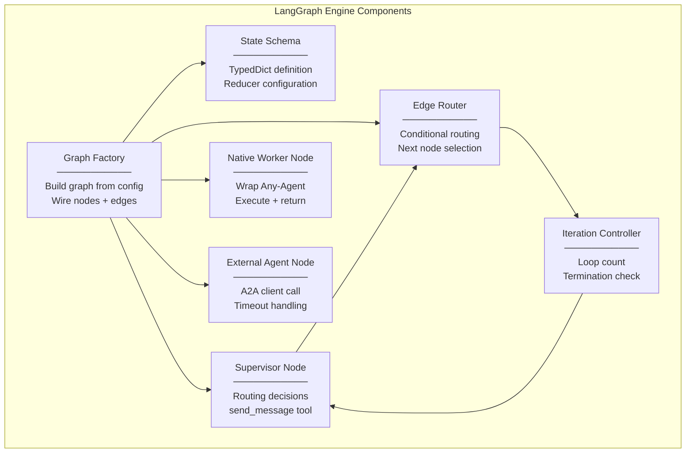
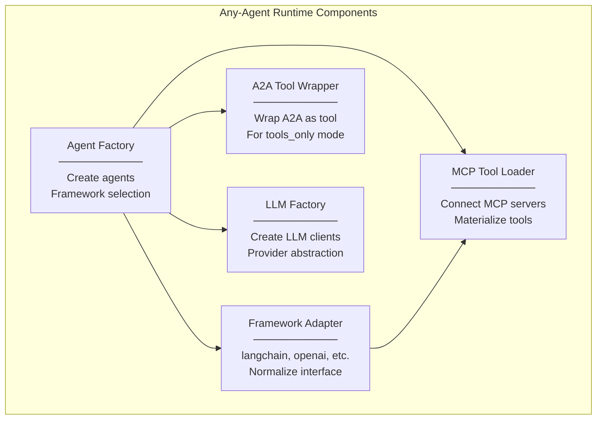
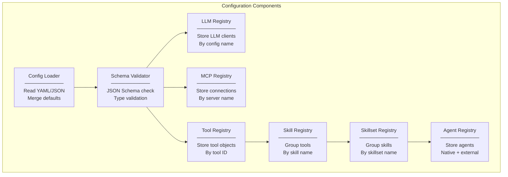
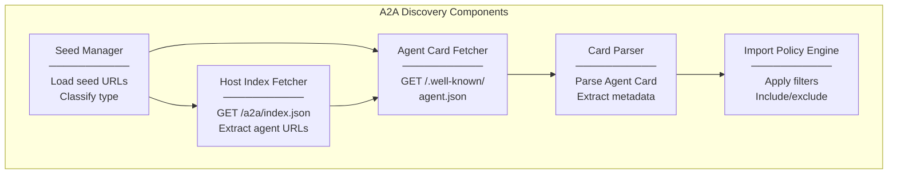
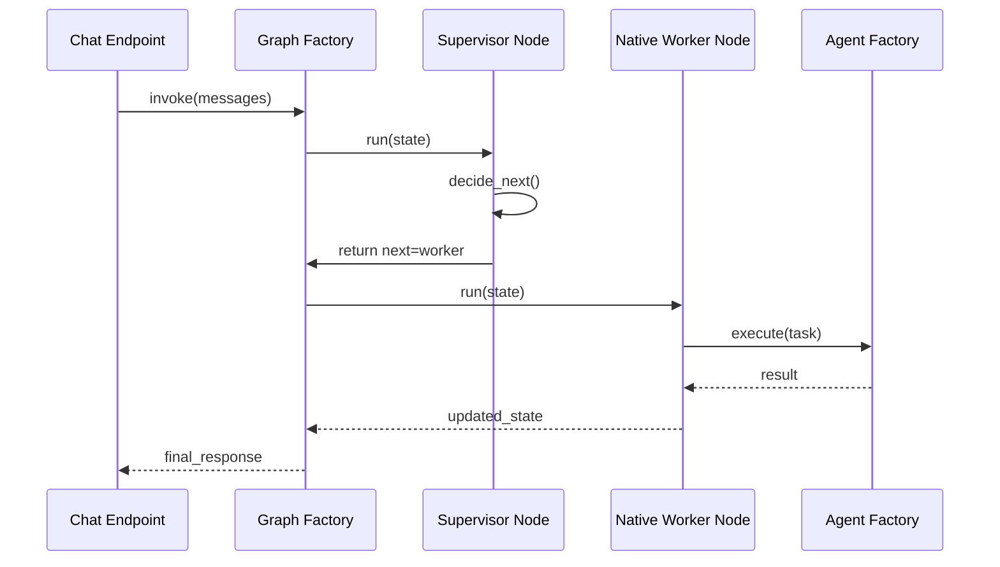
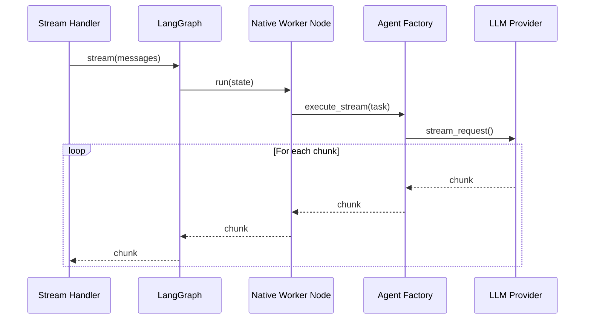

# D06: Component Overview (C4 Level 3)

## Config-Driven Multi-Agent Orchestration System

**Document ID:** D06  
**Version:** 1.0  
**Status:** Draft  
**Last Updated:** January 2026

---

## 1. Overview

This document presents the C4 Level 3 (Component) diagram, showing the internal components within each container and their interactions.

---

## 2. Full System Component Diagram



---

## 3. Component Details by Container

### 3.1 API Server Components



| Component | Responsibility | Interfaces |
|-----------|----------------|------------|
| **API Router** | Dispatch requests to endpoints, apply middleware | Inbound HTTP |
| **Chat Endpoint** | Handle `/chat` requests, invoke LangGraph | REST, WebSocket |
| **Agents Endpoint** | Return list of available agents | REST GET |
| **Health Endpoint** | System health status | REST GET |
| **OpenAI Facade** | Translate OpenAI format to internal format | REST POST |
| **Stream Handler** | Format and deliver SSE chunks | SSE |
| **Request Validator** | Validate request payloads | Pydantic |

### 3.2 LangGraph Engine Components



| Component | Responsibility | Key Methods |
|-----------|----------------|-------------|
| **Graph Factory** | Construct LangGraph from agent registry | `build_graph()`, `compile()` |
| **State Schema** | Define graph state structure | TypedDict class |
| **Supervisor Node** | Route tasks, handle ambiguity | `run()`, `decide_next()` |
| **Native Worker Node** | Execute native agent, return result | `run()`, `invoke_agent()` |
| **External Agent Node** | Call A2A agent, handle response | `run()`, `a2a_call()` |
| **Edge Router** | Determine next node from state | `route()` |
| **Iteration Controller** | Enforce max iterations | `check_limit()` |

### 3.3 Any-Agent Runtime Components



| Component | Responsibility | Key Methods |
|-----------|----------------|-------------|
| **Agent Factory** | Instantiate Any-Agent with config | `create_agent()`, `create_async()` |
| **Framework Adapter** | Map framework-specific APIs to unified interface | `get_adapter()` |
| **MCP Tool Loader** | Connect to MCP servers, get tools | `connect()`, `get_tools()` |
| **A2A Tool Wrapper** | Wrap external agent as callable tool | `wrap_as_tool()` |
| **LLM Factory** | Create LLM client from config | `create_llm()` |

### 3.4 Configuration Components



| Component | Responsibility | Storage Format |
|-----------|----------------|----------------|
| **Config Loader** | Parse config files, apply defaults | YAML/JSON → dict |
| **Schema Validator** | Validate against JSON Schema | Pydantic models |
| **LLM Registry** | Map config names to LLM clients | `Dict[str, LLMClient]` |
| **MCP Registry** | Map server names to connections | `Dict[str, MCPConnection]` |
| **Tool Registry** | Map tool IDs to callable objects | `Dict[str, Tool]` |
| **Skill Registry** | Map skill names to tool lists | `Dict[str, List[str]]` |
| **Skillset Registry** | Map skillset names to skill lists | `Dict[str, List[str]]` |
| **Agent Registry** | Map agent names to agent objects | `Dict[str, Agent]` |

### 3.5 A2A Discovery Components



| Component | Responsibility | Key Methods |
|-----------|----------------|-------------|
| **Seed Manager** | Iterate seed URLs, detect type | `process_seeds()` |
| **Host Index Fetcher** | Fetch multi-agent host index | `fetch_index()` |
| **Agent Card Fetcher** | Fetch individual Agent Card | `fetch_card()` |
| **Card Parser** | Parse JSON to AgentCard model | `parse()` |
| **Import Policy Engine** | Apply include/exclude rules | `apply_policy()` |

---

## 4. Component Dependency Matrix

```
                    │ LLM  │ MCP  │ Tool │ Skill│ S.Set│ Agent│
                    │ Reg  │ Reg  │ Reg  │ Reg  │ Reg  │ Reg  │
────────────────────┼──────┼──────┼──────┼──────┼──────┼──────┤
LLM Factory         │  R   │      │      │      │      │      │
MCP Tool Loader     │      │  R   │  W   │      │      │      │
Skill Registry      │      │      │  R   │  W   │      │      │
Skillset Registry   │      │      │      │  R   │  W   │      │
Agent Factory       │  R   │      │      │      │  R   │  W   │
Graph Factory       │      │      │      │      │      │  R   │
Import Policy Engine│      │      │      │      │      │  W   │

R = Reads from    W = Writes to
```

---

## 5. Component Communication Patterns

### 5.1 Synchronous Request-Response



### 5.2 Streaming Pass-Through



---

## 6. Error Handling by Component

| Component | Error Type | Handling Strategy |
|-----------|------------|-------------------|
| Config Loader | Invalid YAML | Fail fast, clear error message |
| Schema Validator | Schema violation | Fail fast, list violations |
| MCP Tool Loader | Connection failed | Log warning, skip server |
| Agent Card Fetcher | HTTP error | Log warning, skip agent |
| Import Policy Engine | No agents pass filter | Log warning, continue |
| Supervisor Node | Routing ambiguity | Use send_message |
| Native Worker Node | Tool error | Return error in result |
| External Agent Node | Timeout | Return timeout error |
| Iteration Controller | Max iterations | Force END state |

---

## 7. Related Documents

- D05: Container Diagram (C4 Level 2)
- D10-D24: Module Specifications (LLD)
- D34-D42: Sequence Diagrams

---

## 8. Revision History

| Version | Date | Author | Changes |
|---------|------|--------|---------|
| 1.0 | Jan 2026 | Architecture Team | Initial draft |
