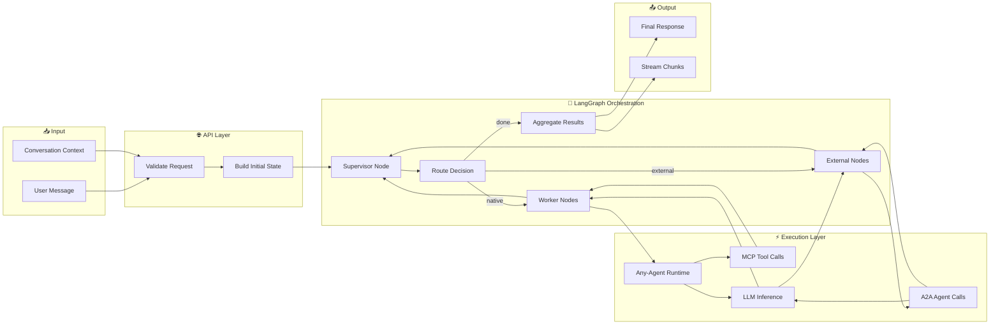
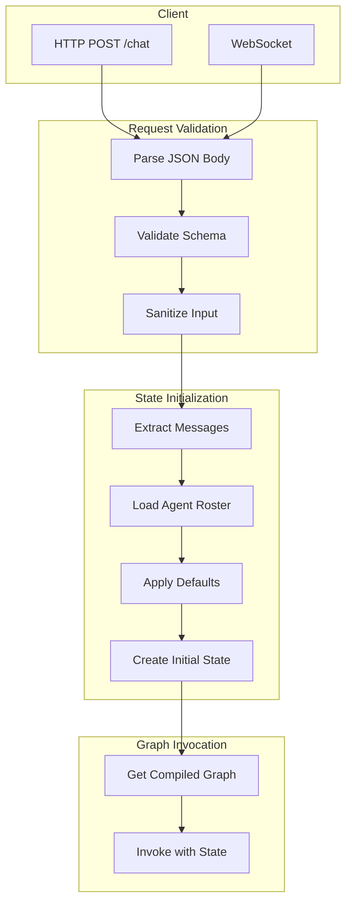
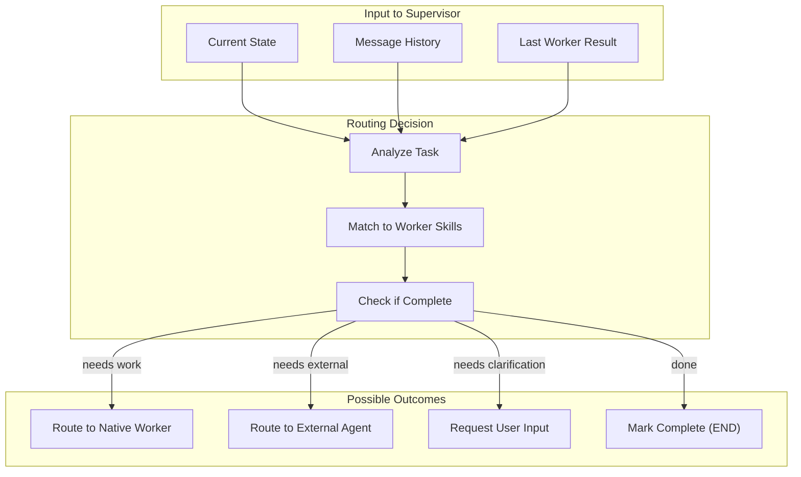
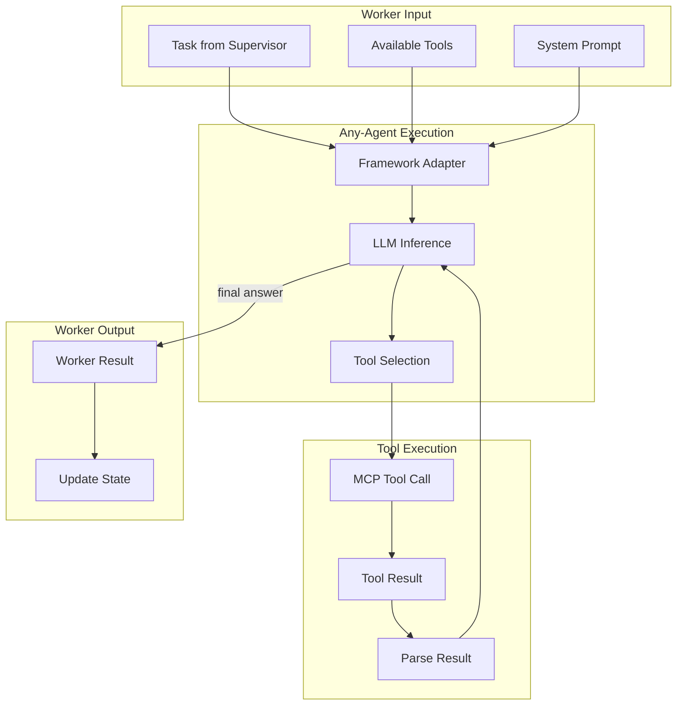
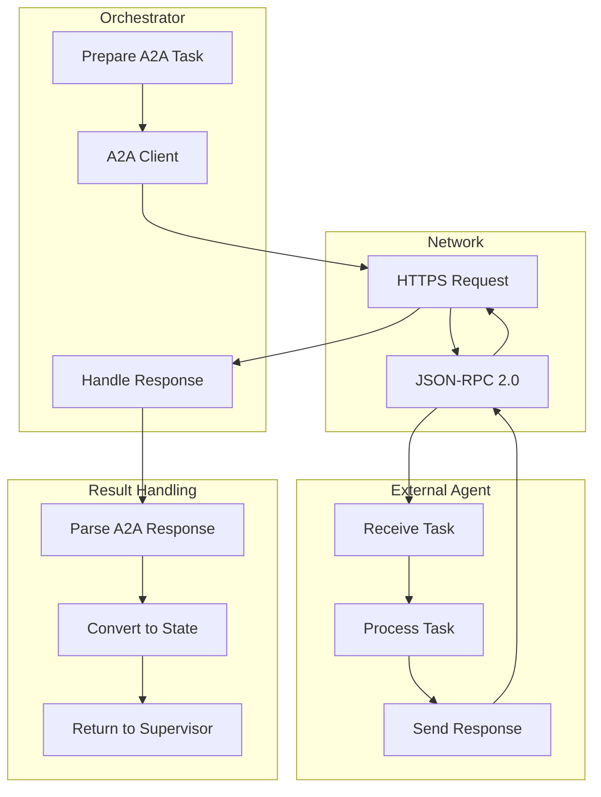
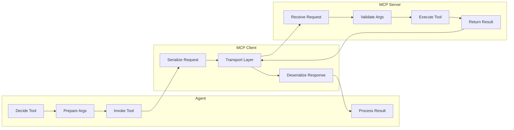
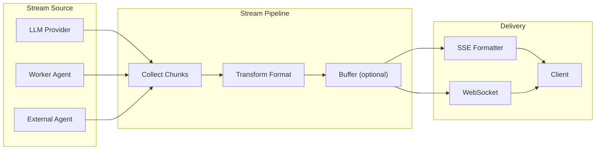
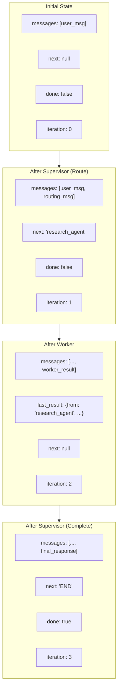
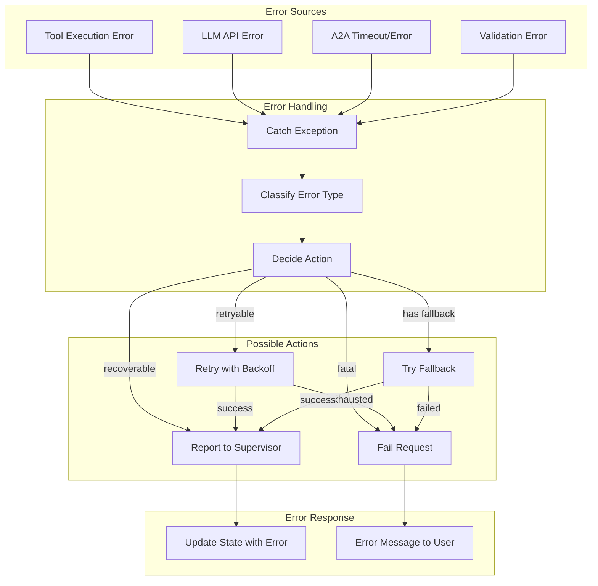

# D07: Data Flow Architecture

## Config-Driven Multi-Agent Orchestration System

**Document ID:** D07  
**Version:** 1.0  
**Status:** Draft  
**Last Updated:** January 2026

---

## 1. Overview

This document describes how data flows through the Multi-Agent Orchestration System, from user input to final response. Understanding data flow is critical for debugging, performance optimization, and ensuring correct state management.

---

## 2. End-to-End Data Flow



---

## 3. Request Processing Flow

### 3.1 Inbound Request Flow



### 3.2 Request Data Structure

```python
# Inbound Request
{
    "messages": [
        {"role": "user", "content": "..."},
        {"role": "assistant", "content": "..."}
    ],
    "stream": true,
    "context": {
        "session_id": "...",
        "metadata": {}
    }
}

# Initial Graph State
{
    "messages": [...],
    "task": "normalized user request",
    "context": {...},
    "roster": ["research_agent", "code_agent", "ext::analytics"],
    "last_result": None,
    "next": None,
    "done": False,
    "iteration": 0
}
```

---

## 4. Supervisor Routing Flow

### 4.1 Routing Decision Process



### 4.2 Routing State Update

```python
# Supervisor Output
{
    "next": "research_agent",  # or "ext::analytics" or "END"
    "messages": [
        # Supervisor's routing message
        {"role": "assistant", "content": "Routing to research agent..."}
    ],
    "context": {
        "routing_reason": "Task requires web research",
        "expected_output": "Summary of findings"
    }
}
```

---

## 5. Worker Execution Flow

### 5.1 Native Worker Data Flow



### 5.2 Worker Result Structure

```python
# Worker Result
{
    "from": "research_agent",
    "output": {
        "type": "text",
        "content": "Research findings...",
        "sources": ["https://..."],
        "tool_calls": [
            {"tool": "search_web", "input": "...", "output": "..."}
        ]
    },
    "metadata": {
        "tokens_used": 1500,
        "duration_ms": 3200,
        "tools_invoked": ["search_web", "summarize"]
    }
}
```

---

## 6. External Agent (A2A) Data Flow

### 6.1 A2A Communication Flow



### 6.2 A2A Message Structures

```python
# A2A Request (JSON-RPC 2.0)
{
    "jsonrpc": "2.0",
    "method": "message/send",
    "id": "req-123",
    "params": {
        "message": {
            "role": "user",
            "parts": [
                {"type": "text", "text": "Analyze this data..."}
            ]
        },
        "configuration": {
            "timeout": 40
        }
    }
}

# A2A Response
{
    "jsonrpc": "2.0",
    "id": "req-123",
    "result": {
        "task": {
            "id": "task-456",
            "status": "COMPLETED",
            "result": {
                "role": "agent",
                "parts": [
                    {"type": "text", "text": "Analysis complete..."}
                ]
            }
        }
    }
}
```

---

## 7. MCP Tool Data Flow

### 7.1 Tool Invocation Flow



### 7.2 MCP Message Structures

```python
# MCP Tool Call Request
{
    "jsonrpc": "2.0",
    "method": "tools/call",
    "id": 1,
    "params": {
        "name": "search.web",
        "arguments": {
            "query": "latest AI research",
            "limit": 10
        }
    }
}

# MCP Tool Call Response
{
    "jsonrpc": "2.0",
    "id": 1,
    "result": {
        "content": [
            {
                "type": "text",
                "text": "Search results..."
            }
        ],
        "isError": false
    }
}
```

---

## 8. Streaming Data Flow

### 8.1 Stream Pipeline



### 8.2 Stream Chunk Structure

```python
# SSE Stream Chunk
data: {"type": "chunk", "content": "Here is", "done": false}

data: {"type": "chunk", "content": " the analysis", "done": false}

data: {"type": "chunk", "content": "...", "done": false}

data: {"type": "done", "content": "", "done": true, "metadata": {...}}
```

---

## 9. State Transitions

### 9.1 Graph State Evolution



### 9.2 State Reducer Operations

| Field | Reducer | Behavior |
|-------|---------|----------|
| `messages` | `add_messages` | Append new messages to list |
| `last_result` | Replace | Overwrite with latest result |
| `next` | Replace | Overwrite with routing decision |
| `done` | Replace | Overwrite with completion flag |
| `iteration` | Increment | Add 1 each supervisor cycle |
| `context` | Merge | Deep merge new context |

---

## 10. Error Data Flow

### 10.1 Error Propagation



### 10.2 Error State Structure

```python
# Error in Worker Result
{
    "from": "research_agent",
    "output": {
        "type": "error",
        "error_code": "TOOL_TIMEOUT",
        "error_message": "search_web timed out after 30s",
        "partial_result": None
    },
    "metadata": {
        "retries_attempted": 2,
        "duration_ms": 90500
    }
}

# Error Response to Client
{
    "error": {
        "code": "EXECUTION_ERROR",
        "message": "Unable to complete research task",
        "details": {
            "worker": "research_agent",
            "cause": "Tool timeout"
        }
    }
}
```

---

## 11. Data Flow Metrics

### 11.1 Key Metrics Points

| Point | Metrics Captured |
|-------|------------------|
| Request Received | `request_count`, `request_size_bytes` |
| Supervisor Decision | `routing_decisions`, `routing_latency_ms` |
| Worker Execution | `worker_duration_ms`, `tools_invoked` |
| MCP Tool Call | `tool_latency_ms`, `tool_success_rate` |
| A2A Call | `a2a_latency_ms`, `a2a_success_rate` |
| LLM Inference | `llm_latency_ms`, `tokens_used` |
| Response Sent | `response_latency_ms`, `response_size_bytes` |

---

## 12. Related Documents

- D05: Container Diagram
- D06: Component Overview
- D08: Integration Architecture
- D34-D42: Sequence Diagrams

---

## 13. Revision History

| Version | Date | Author | Changes |
|---------|------|--------|---------|
| 1.0 | Jan 2026 | Architecture Team | Initial draft |
