# D08: Integration Architecture

## Config-Driven Multi-Agent Orchestration System

**Document ID:** D08  
**Version:** 1.0  
**Status:** Draft  
**Last Updated:** January 2026

---

## 1. Overview

This document describes how the Multi-Agent Orchestration System integrates with external systems: LLM providers, MCP servers, and A2A external agents. Each integration point has specific patterns, protocols, and failure modes.

---

## 2. Integration Landscape

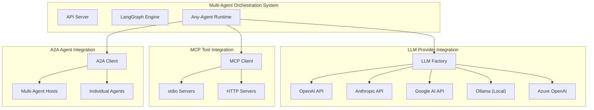

---

## 3. LLM Provider Integration

### 3.1 Provider Architecture

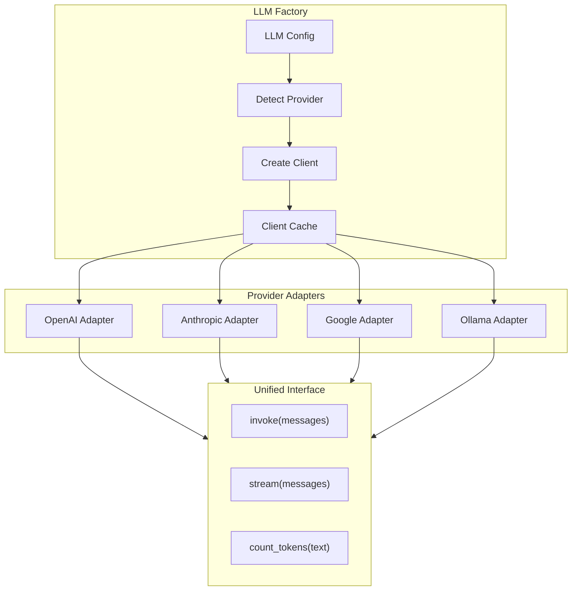

### 3.2 Provider Configuration Matrix

| Provider | Auth Method | Endpoint | Streaming | Tool Calling |
|----------|-------------|----------|-----------|--------------|
| OpenAI | API Key (Bearer) | `api.openai.com` | ✅ SSE | ✅ Native |
| Anthropic | API Key (x-api-key) | `api.anthropic.com` | ✅ SSE | ✅ Native |
| Google | API Key | `generativelanguage.googleapis.com` | ✅ SSE | ✅ Native |
| Ollama | None | `localhost:11434` | ✅ SSE | ✅ OpenAI-compat |
| Azure OpenAI | API Key | Custom endpoint | ✅ SSE | ✅ Native |

### 3.3 LLM Request/Response Flow

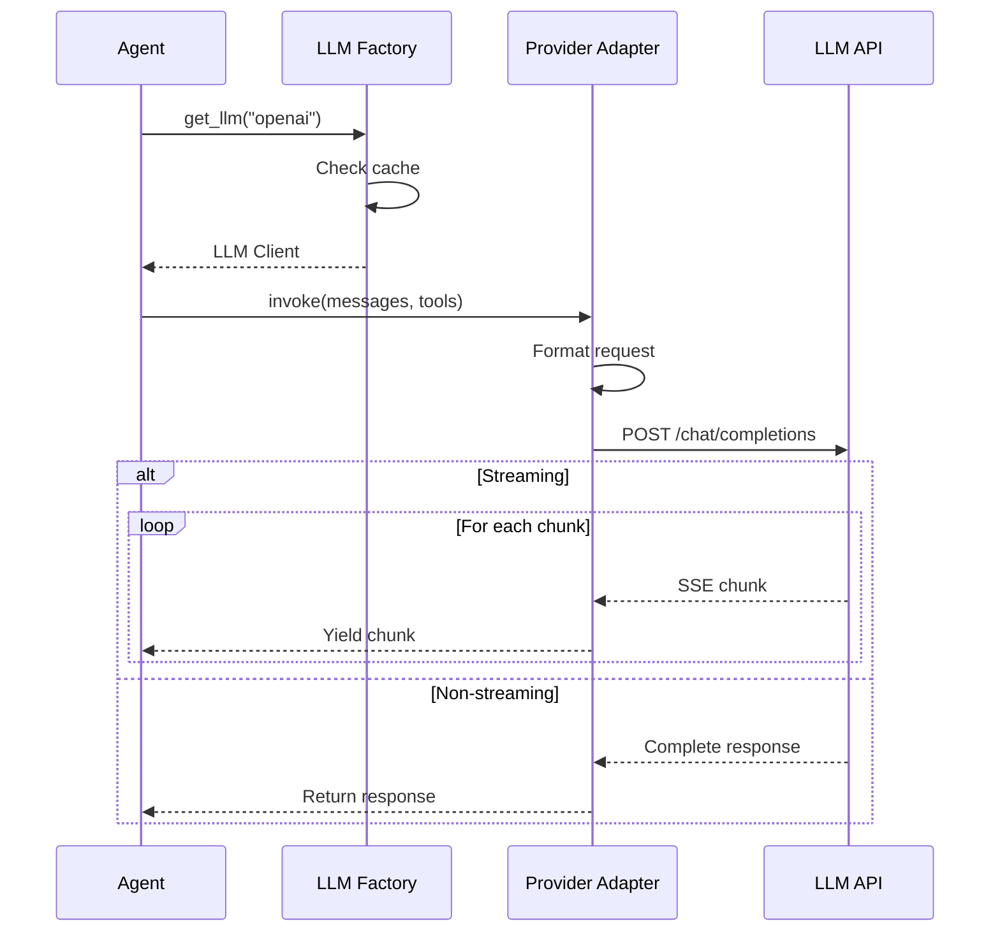

### 3.4 LLM Error Handling

| Error Type | HTTP Status | Retry | Action |
|------------|-------------|-------|--------|
| Rate limit | 429 | Yes (with backoff) | Wait and retry |
| Auth error | 401, 403 | No | Fail with config error |
| Server error | 500, 502, 503 | Yes (limited) | Retry up to 3 times |
| Timeout | - | Yes | Retry with longer timeout |
| Invalid request | 400 | No | Fail with validation error |

---

## 4. MCP Server Integration

### 4.1 MCP Transport Architecture

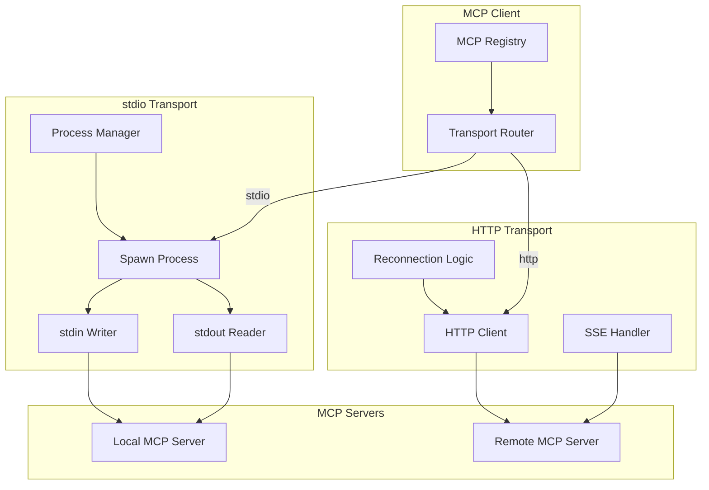

### 4.2 MCP Connection Lifecycle

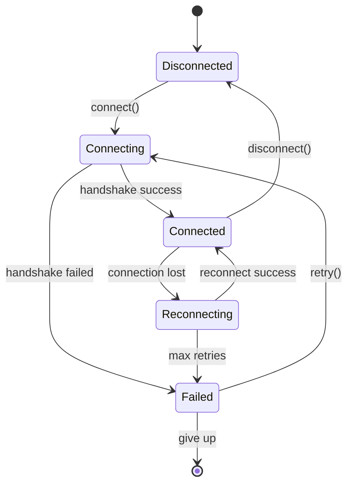

### 4.3 MCP Tool Discovery Flow

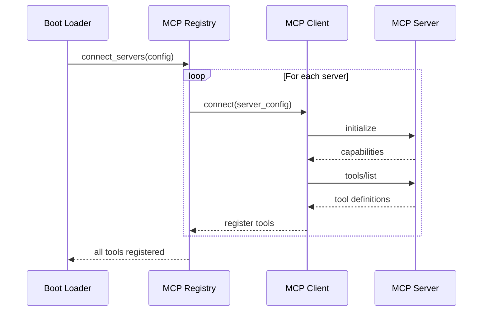

### 4.4 MCP Tool Call Flow

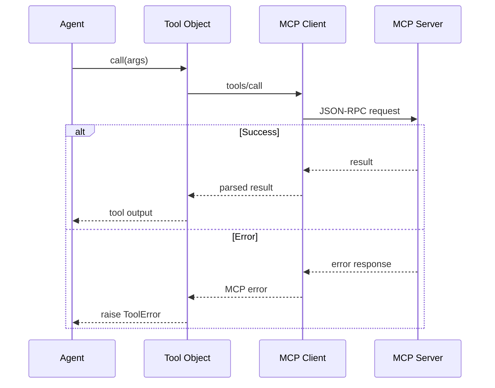

---

## 5. A2A Agent Integration

### 5.1 A2A Discovery Architecture

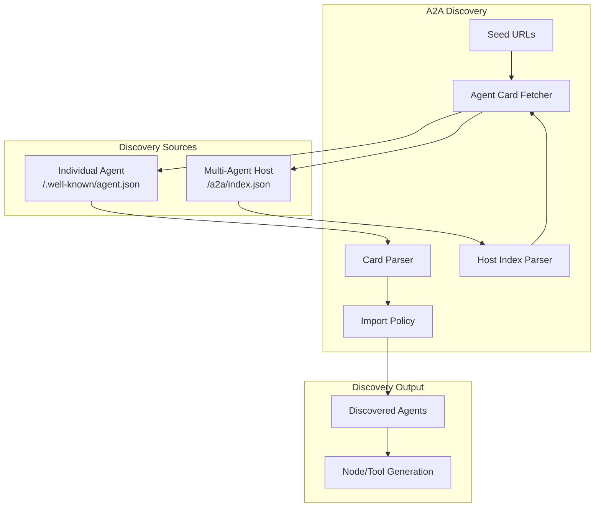

### 5.2 Host Index Structure

```json
{
  "version": "1.0",
  "host": {
    "name": "Analytics Agent Host",
    "description": "Hosts specialized analytics agents"
  },
  "agents": [
    {
      "name": "data-analyzer",
      "path": "/a2a/data-analyzer",
      "agent_card_path": "/a2a/data-analyzer/.well-known/agent.json"
    },
    {
      "name": "ml-predictor",
      "path": "/a2a/ml-predictor",
      "agent_card_path": "/a2a/ml-predictor/.well-known/agent.json"
    }
  ]
}
```

### 5.3 A2A Communication Flow

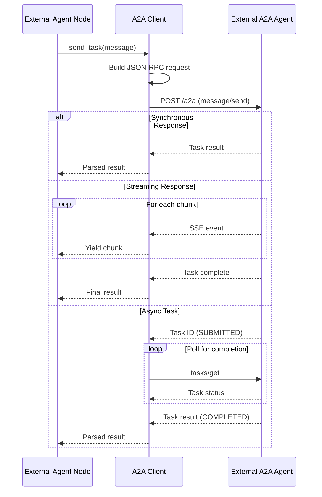

### 5.4 A2A Task State Machine

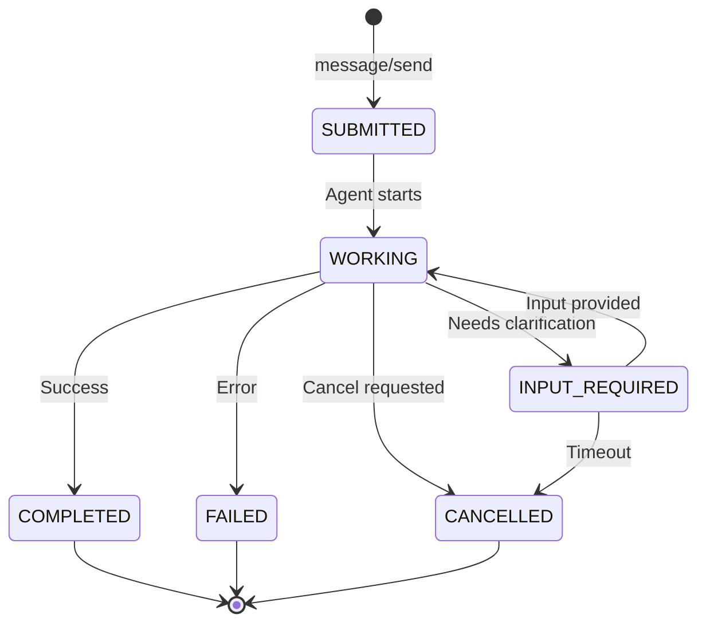

### 5.5 A2A Authentication (Future)

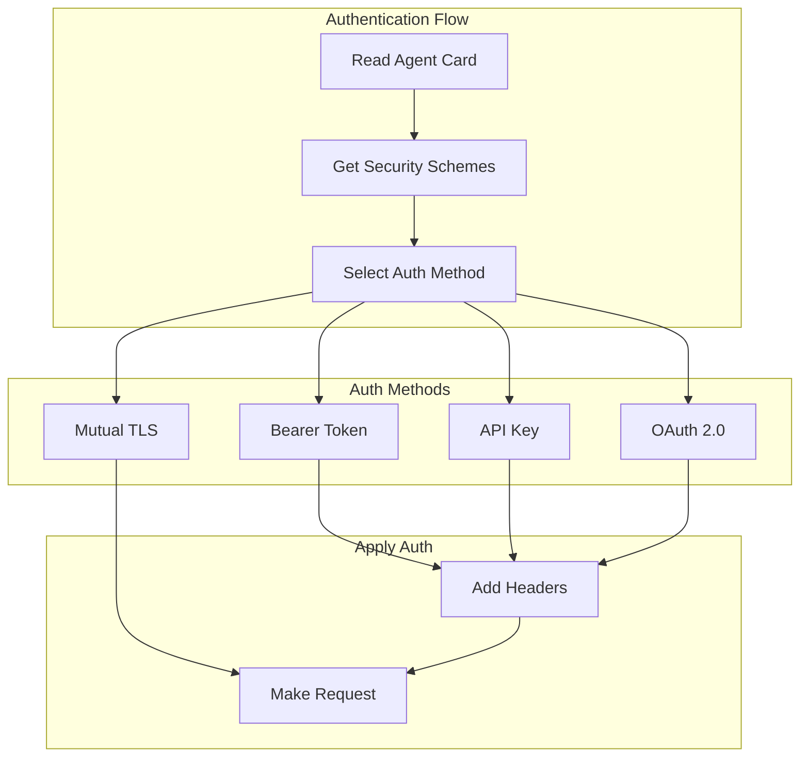

---

## 6. Integration Failure Modes

### 6.1 Failure Classification

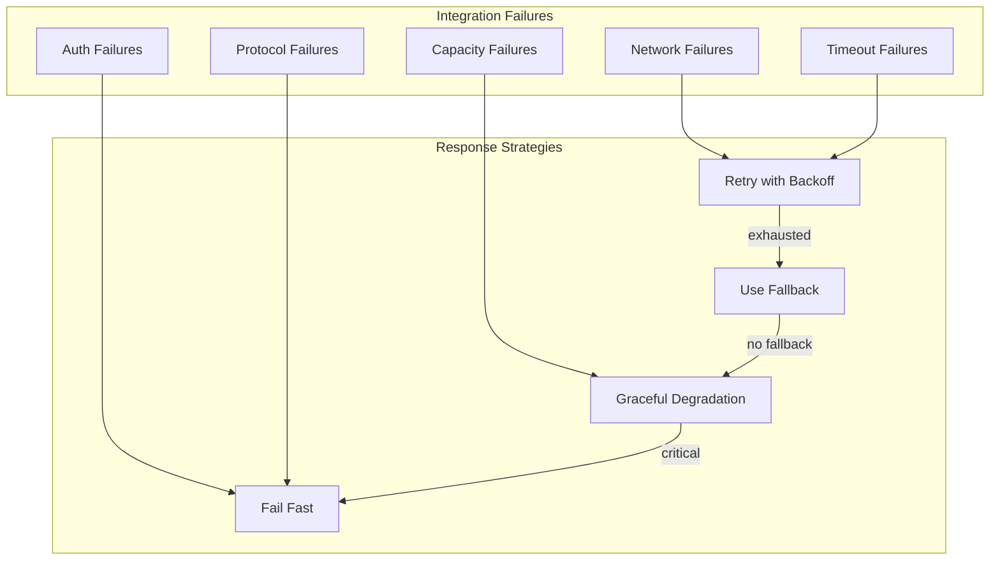

### 6.2 Failure Handling Matrix

| Integration | Failure Type | Retry | Fallback | Degradation |
|-------------|--------------|-------|----------|-------------|
| LLM | Rate limit | Yes (backoff) | Alt provider | Reduced tokens |
| LLM | Timeout | Yes (2x) | Alt provider | Shorter prompt |
| MCP (stdio) | Process crash | Yes (respawn) | None | Skip tool |
| MCP (HTTP) | Connection lost | Yes (3x) | None | Skip tool |
| A2A | Timeout | Yes (1x) | None | Skip agent |
| A2A | Auth failure | No | None | Skip agent |

---

## 7. Integration Monitoring

### 7.1 Health Check Architecture

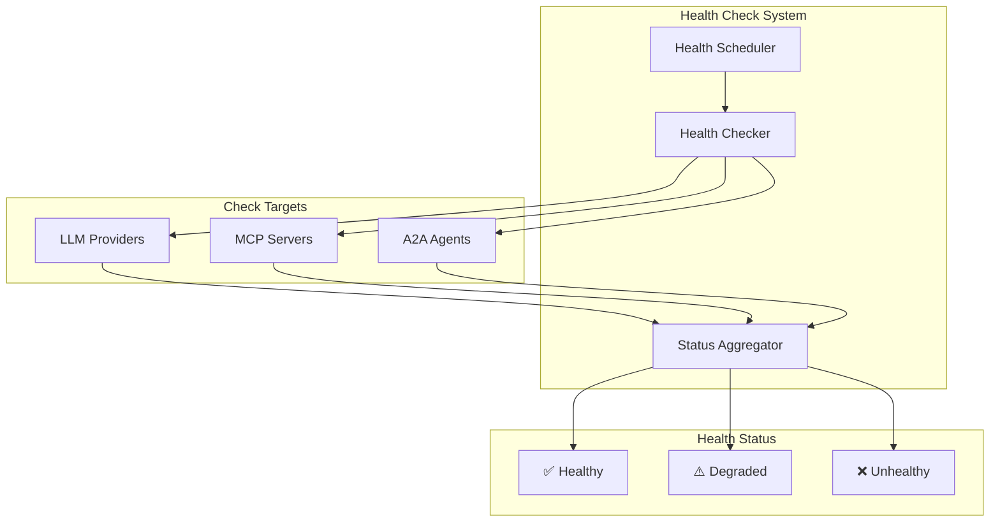

### 7.2 Health Check Endpoints

| Integration | Health Check Method | Interval |
|-------------|---------------------|----------|
| LLM (OpenAI) | `GET /v1/models` | 60s |
| LLM (Anthropic) | Test completion | 60s |
| LLM (Ollama) | `GET /api/tags` | 30s |
| MCP (stdio) | Process alive check | 10s |
| MCP (HTTP) | `GET /health` or ping | 30s |
| A2A | Fetch Agent Card | 60s |

---

## 8. Integration Configuration

### 8.1 Connection Pool Settings

```yaml
integration:
  llm:
    connection_pool_size: 10
    keepalive_timeout: 30
    retry_attempts: 3
    retry_backoff_base: 1.0
    retry_backoff_max: 30.0

  mcp:
    stdio:
      process_restart_delay: 5
      max_restart_attempts: 3
    http:
      connection_pool_size: 5
      request_timeout: 30

  a2a:
    connection_pool_size: 10
    discovery_timeout: 15
    request_timeout: 40
    stream_timeout: 120
```

### 8.2 Circuit Breaker Settings

```yaml
circuit_breaker:
  enabled: true
  failure_threshold: 5
  success_threshold: 3
  timeout: 60
  half_open_requests: 1
```

---

## 9. Security Considerations

### 9.1 Integration Security Matrix

| Integration | Transport Security | Auth Storage | Data Sensitivity |
|-------------|-------------------|--------------|------------------|
| LLM APIs | TLS 1.2+ | Env vars | High (prompts) |
| MCP (stdio) | N/A (local) | N/A | Medium (tool data) |
| MCP (HTTP) | TLS 1.2+ | Env vars | Medium (tool data) |
| A2A | TLS 1.2+ | Env vars (future) | High (task data) |

### 9.2 Secret Management

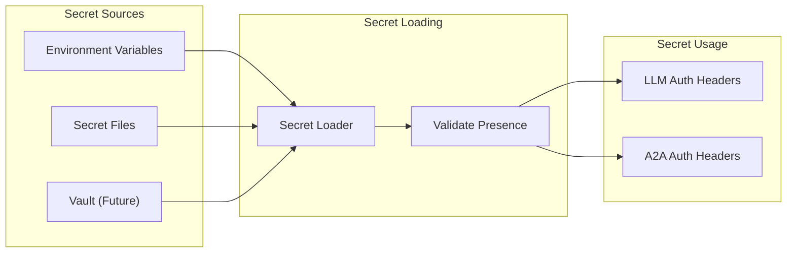

---

## 10. Related Documents

- D07: Data Flow Architecture
- D09: Technology Stack
- D10-D24: Module Specifications
- D34-D42: Sequence Diagrams

---

## 11. Revision History

| Version | Date | Author | Changes |
|---------|------|--------|---------|
| 1.0 | Jan 2026 | Architecture Team | Initial draft |
