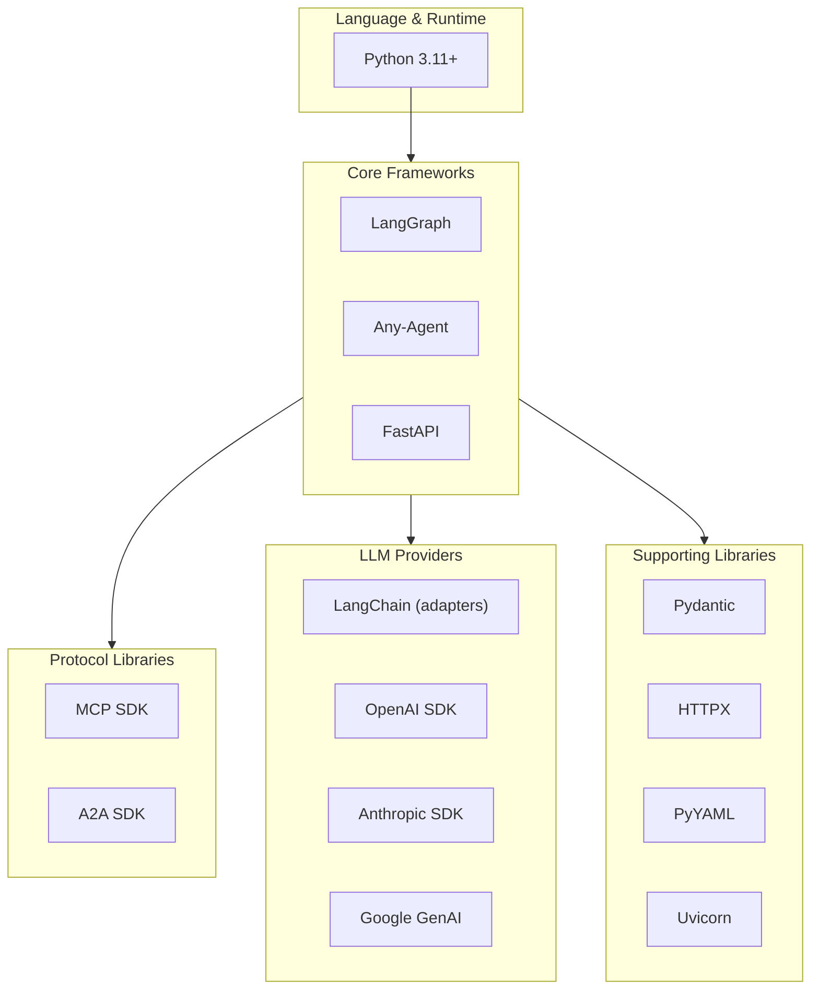

# D09: Technology Stack & Rationale

## Config-Driven Multi-Agent Orchestration System

**Document ID:** D09  
**Version:** 1.0  
**Status:** Draft  
**Last Updated:** January 2026

---

## 1. Overview

This document details the technology stack selected for the Multi-Agent Orchestration System prototype, with rationale for each choice.

---

## 2. Stack Summary



---

## 3. Core Technology Decisions

### 3.1 Language: Python 3.11+

| Aspect | Decision | Rationale |
|--------|----------|-----------|
| **Language** | Python | De facto standard for AI/ML; best library ecosystem |
| **Version** | 3.11+ | Required by Any-Agent; performance improvements; better typing |

**Alternatives Considered:**
- **TypeScript/Node.js**: Strong async, but weaker ML ecosystem
- **Go**: Performance, but limited AI libraries
- **Java/Spring**: Enterprise-ready, but not aligned with LangGraph ecosystem

### 3.2 Orchestration: LangGraph

| Aspect | Value |
|--------|-------|
| **Package** | `langgraph` >= 0.2.0 |
| **Additional** | `langgraph-supervisor` >= 0.1.0 |

**Why LangGraph:**
- Company strategic direction
- Mature supervisor pattern implementation
- Built-in state management with reducers
- Conditional edge routing
- Streaming support
- Active LangChain ecosystem support

**Limitations Accepted:**
- No runtime node addition (must compile before execution)
- Python-only (no polyglot)

### 3.3 Agent Abstraction: Any-Agent

| Aspect | Value |
|--------|-------|
| **Package** | `any-agent` >= 1.14.0 |
| **Extras** | `any-agent[langchain,openai,google]` as needed |

**Why Any-Agent:**
- Framework-agnostic agent creation
- Native MCP support (MCPStdio, MCPSse)
- Native A2A support (a2a_tool_async, serving)
- Unified tracing (OpenInference format)
- Mozilla AI backing, active development

**Key Capabilities Used:**
- `AnyAgent.create()` / `AnyAgent.create_async()`
- `AgentConfig` for unified configuration
- MCP tool integration via config objects
- A2A tool wrapping via `a2a_tool_async()`
- Serving via `serve_async()` for hosted agents

### 3.4 API Framework: FastAPI

| Aspect | Value |
|--------|-------|
| **Package** | `fastapi` >= 0.100.0 |
| **Server** | `uvicorn` >= 0.23.0 |
| **Streaming** | `sse-starlette` >= 1.6.0 |

**Why FastAPI:**
- Async-native (critical for streaming, concurrent requests)
- Automatic OpenAPI documentation
- Pydantic integration for validation
- WebSocket support
- Production-proven at scale

---

## 4. Protocol Libraries

### 4.1 MCP (Model Context Protocol)

| Aspect | Value |
|--------|-------|
| **Package** | `mcp` >= 1.0.0 |
| **High-level** | `fastmcp` for server implementation |
| **Adapters** | `langchain-mcp-adapters` (optional) |

**Transport Support:**
| Transport | Use Case | Package Support |
|-----------|----------|-----------------|
| stdio | Local tools | Native |
| HTTP/SSE | Remote tools | Native |
| Streamable HTTP | New standard | Native (v1.0+) |

### 4.2 A2A (Agent-to-Agent Protocol)

| Aspect | Value |
|--------|-------|
| **Package** | `a2a-sdk` >= 0.3.0 |
| **Client** | `A2AClient` for consuming external agents |
| **Server** | `A2AStarletteApplication` for serving agents |

**Key Classes:**
- `AgentCard` — Parsed discovery metadata
- `SendMessageRequest` / `SendMessageResponse` — Communication
- `Task` — Stateful task tracking

---

## 5. LLM Provider Libraries

### 5.1 Provider Matrix

| Provider | Package | Model Format |
|----------|---------|--------------|
| OpenAI | `openai` >= 1.0.0 | `gpt-4o`, `gpt-4-turbo` |
| Anthropic | `anthropic` >= 0.25.0 | `claude-3-opus`, `claude-3-sonnet` |
| Google | `google-generativeai` >= 0.5.0 | `gemini-1.5-pro`, `gemini-2.0-flash` |
| Ollama | OpenAI-compatible | Any Ollama model |
| Azure OpenAI | `openai` with azure config | Azure-hosted models |

### 5.2 Abstraction Layer

| Aspect | Value |
|--------|-------|
| **Any-Agent Format** | `provider/model` or `provider:model` |
| **Examples** | `openai/gpt-4o`, `anthropic/claude-3-sonnet`, `ollama/qwen2.5:latest` |

**LangChain Adapters (for LangGraph integration):**
- `langchain-openai`
- `langchain-anthropic`
- `langchain-google-genai`
- `langchain-community` (for Ollama)

---

## 6. Supporting Libraries

### 6.1 Data Validation: Pydantic

| Aspect | Value |
|--------|-------|
| **Package** | `pydantic` >= 2.0.0 |
| **Usage** | Config models, API models, Agent Card parsing |

**Key Features Used:**
- `BaseModel` for structured data
- `Field` for validation rules
- JSON Schema generation for config validation

### 6.2 HTTP Client: HTTPX

| Aspect | Value |
|--------|-------|
| **Package** | `httpx` >= 0.25.0 |
| **Usage** | A2A discovery, Agent Card fetching, host index |

**Why HTTPX over Requests:**
- Async support (critical for boot-time parallel discovery)
- HTTP/2 support
- Better timeout handling

### 6.3 Configuration: PyYAML

| Aspect | Value |
|--------|-------|
| **Package** | `pyyaml` >= 6.0 |
| **Usage** | Parse YAML configuration files |

### 6.4 JSON Schema Validation

| Aspect | Value |
|--------|-------|
| **Package** | `jsonschema` >= 4.0.0 |
| **Usage** | Validate config against master schema |

---

## 7. Development & Testing

### 7.1 Testing Framework

| Aspect | Value |
|--------|-------|
| **Framework** | `pytest` >= 7.0.0 |
| **Async** | `pytest-asyncio` >= 0.21.0 |
| **Mocking** | `pytest-mock`, `respx` (for HTTPX) |

### 7.2 Code Quality

| Tool | Purpose |
|------|---------|
| `ruff` | Linting + formatting (replaces black, isort, flake8) |
| `mypy` | Static type checking |
| `pre-commit` | Git hooks for quality gates |

### 7.3 Development Tools

| Tool | Purpose |
|------|---------|
| `python-dotenv` | Environment variable management |
| `rich` | CLI output formatting |
| `structlog` | Structured logging |

---

## 8. Dependency Summary

### 8.1 Core Dependencies (requirements.txt)

```
# Core Frameworks
langgraph>=0.2.0
langgraph-supervisor>=0.1.0
any-agent[langchain,openai,google]>=1.14.0
fastapi>=0.100.0
uvicorn[standard]>=0.23.0

# Protocol Support
mcp>=1.0.0
a2a-sdk>=0.3.0

# LLM Providers
openai>=1.0.0
anthropic>=0.25.0
google-generativeai>=0.5.0
langchain-openai>=0.1.0
langchain-anthropic>=0.1.0
langchain-google-genai>=0.1.0
langchain-community>=0.1.0

# Supporting
pydantic>=2.0.0
httpx>=0.25.0
pyyaml>=6.0
jsonschema>=4.0.0
sse-starlette>=1.6.0

# Utilities
python-dotenv>=1.0.0
structlog>=23.0.0
```

### 8.2 Development Dependencies (requirements-dev.txt)

```
pytest>=7.0.0
pytest-asyncio>=0.21.0
pytest-mock>=3.0.0
respx>=0.20.0
ruff>=0.1.0
mypy>=1.0.0
pre-commit>=3.0.0
```

---

## 9. Version Compatibility Matrix

| Component | Min Version | Max Tested | Notes |
|-----------|-------------|------------|-------|
| Python | 3.11 | 3.12 | Any-Agent requires 3.11+ |
| LangGraph | 0.2.0 | 0.2.x | Supervisor pattern support |
| Any-Agent | 1.14.0 | 1.14.x | MCP + A2A support |
| FastAPI | 0.100.0 | 0.115.x | Async + streaming |
| Pydantic | 2.0.0 | 2.x | V2 required for FastAPI 0.100+ |
| MCP SDK | 1.0.0 | 1.x | Streamable HTTP support |
| A2A SDK | 0.3.0 | 0.3.x | Latest protocol version |

---

## 10. Deployment Requirements

### 10.1 Runtime Environment

| Requirement | Value |
|-------------|-------|
| Python | 3.11+ |
| Memory | 2GB minimum (4GB recommended) |
| CPU | 2 cores minimum |
| Disk | 500MB for dependencies |
| Network | Outbound HTTPS for LLM APIs |

### 10.2 Containerization (Optional)

```dockerfile
FROM python:3.11-slim

WORKDIR /app
COPY requirements.txt .
RUN pip install --no-cache-dir -r requirements.txt

COPY . .
CMD ["uvicorn", "main:app", "--host", "0.0.0.0", "--port", "7777"]
```

---

## 11. Risk Assessment

| Technology | Risk | Mitigation |
|------------|------|------------|
| Any-Agent | Young project (Mozilla AI) | Pin version, monitor releases |
| A2A SDK | Protocol still evolving | Isolate behind adapter layer |
| LangGraph | Breaking changes possible | Pin version, test upgrades |
| MCP | Anthropic-controlled | Widely adopted, low risk |

---

## 12. Related Documents

- D02: Architecture Vision & Goals
- D05: Container Diagram
- D54: Dependency Matrix (detailed)

---

## 13. Revision History

| Version | Date | Author | Changes |
|---------|------|--------|---------|
| 1.0 | Jan 2026 | Architecture Team | Initial draft |
