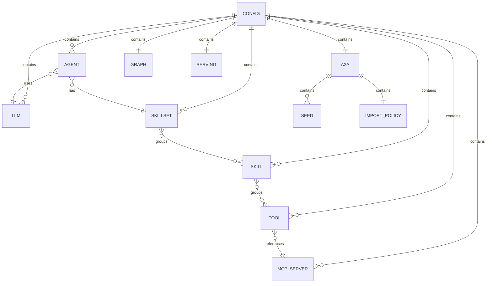

# D25: Master Config Schema

## Config-Driven Multi-Agent Orchestration System

**Document ID:** D25  
**Version:** 1.0  
**Status:** Draft  
**Last Updated:** January 2026

---

## 1. Overview

This document defines the JSON Schema for the master configuration file that drives the entire Multi-Agent Orchestration System. The config file is the single source of truth for LLMs, MCP servers, tools, skills, skillsets, agents, A2A settings, graph behavior, and serving options.

---

## 2. Config Structure Overview



---

## 3. JSON Schema Definition

```json
{
  "$schema": "http://json-schema.org/draft-07/schema#",
  "$id": "https://example.com/multi-agent-orchestration/config.schema.json",
  "title": "Multi-Agent Orchestration Config",
  "description": "Configuration schema for the config-driven multi-agent orchestration system",
  "type": "object",
  "required": ["llms", "agents"],
  "additionalProperties": false,
  "properties": {
    
    "llms": {
      "type": "object",
      "description": "LLM provider configurations keyed by name",
      "additionalProperties": {
        "$ref": "#/$defs/LLMConfig"
      },
      "minProperties": 1
    },

    "mcp_servers": {
      "type": "object",
      "description": "MCP server configurations keyed by server name",
      "additionalProperties": {
        "$ref": "#/$defs/MCPServerConfig"
      }
    },

    "tools": {
      "type": "object",
      "description": "Tool definitions keyed by tool ID",
      "additionalProperties": {
        "$ref": "#/$defs/ToolConfig"
      }
    },

    "skills": {
      "type": "object",
      "description": "Skill definitions keyed by skill name",
      "additionalProperties": {
        "$ref": "#/$defs/SkillConfig"
      }
    },

    "skillsets": {
      "type": "object",
      "description": "Skillset definitions keyed by skillset name",
      "additionalProperties": {
        "$ref": "#/$defs/SkillsetConfig"
      }
    },

    "agents": {
      "type": "object",
      "description": "Agent definitions keyed by agent name",
      "additionalProperties": {
        "$ref": "#/$defs/AgentConfig"
      },
      "minProperties": 1
    },

    "native_workers": {
      "$ref": "#/$defs/NativeWorkersConfig",
      "description": "Configuration for native worker agents"
    },

    "a2a": {
      "$ref": "#/$defs/A2AConfig",
      "description": "A2A external agent discovery and import configuration"
    },

    "graph": {
      "$ref": "#/$defs/GraphConfig",
      "description": "LangGraph execution configuration"
    },

    "serving": {
      "$ref": "#/$defs/ServingConfig",
      "description": "API and UI serving configuration"
    }
  },

  "$defs": {
    
    "LLMConfig": {
      "type": "object",
      "description": "Configuration for an LLM provider",
      "required": ["provider", "model"],
      "additionalProperties": false,
      "properties": {
        "provider": {
          "type": "string",
          "description": "LLM provider identifier",
          "enum": ["openai", "anthropic", "google", "openai_compatible", "azure_openai", "ollama"]
        },
        "model": {
          "type": "string",
          "description": "Model identifier",
          "examples": ["gpt-4o", "claude-3-sonnet", "gemini-1.5-pro", "qwen2.5:latest"]
        },
        "base_url": {
          "type": "string",
          "format": "uri",
          "description": "Base URL for OpenAI-compatible providers"
        },
        "api_key_env": {
          "type": "string",
          "description": "Environment variable name containing API key",
          "default": "OPENAI_API_KEY"
        },
        "temperature": {
          "type": "number",
          "minimum": 0,
          "maximum": 2,
          "default": 0.7
        },
        "max_tokens": {
          "type": "integer",
          "minimum": 1,
          "maximum": 128000
        },
        "timeout_seconds": {
          "type": "integer",
          "minimum": 1,
          "default": 60
        }
      }
    },

    "MCPServerConfig": {
      "type": "object",
      "description": "Configuration for an MCP server connection",
      "required": ["transport"],
      "additionalProperties": false,
      "properties": {
        "transport": {
          "type": "string",
          "enum": ["stdio", "http", "sse"],
          "description": "Transport mechanism for MCP communication"
        },
        "command": {
          "type": "array",
          "items": {"type": "string"},
          "description": "Command and args for stdio transport",
          "examples": [["python", "-m", "mcp_server_knowledge"]]
        },
        "url": {
          "type": "string",
          "format": "uri",
          "description": "URL for HTTP/SSE transport"
        },
        "env": {
          "type": "object",
          "additionalProperties": {"type": "string"},
          "description": "Environment variables for stdio subprocess"
        },
        "timeout_seconds": {
          "type": "integer",
          "minimum": 1,
          "default": 30
        }
      },
      "allOf": [
        {
          "if": {"properties": {"transport": {"const": "stdio"}}},
          "then": {"required": ["command"]}
        },
        {
          "if": {"properties": {"transport": {"enum": ["http", "sse"]}}},
          "then": {"required": ["url"]}
        }
      ]
    },

    "ToolConfig": {
      "type": "object",
      "description": "Configuration mapping a tool ID to an MCP server tool",
      "required": ["server", "tool_name"],
      "additionalProperties": false,
      "properties": {
        "server": {
          "type": "string",
          "description": "Reference to MCP server name in mcp_servers"
        },
        "tool_name": {
          "type": "string",
          "description": "Tool name as exposed by the MCP server",
          "examples": ["search.web", "github.search_code"]
        },
        "description_override": {
          "type": "string",
          "description": "Override the tool description from MCP"
        },
        "timeout_seconds": {
          "type": "integer",
          "minimum": 1,
          "description": "Override default tool timeout"
        }
      }
    },

    "SkillConfig": {
      "type": "object",
      "description": "A skill groups related tools",
      "required": ["tools"],
      "additionalProperties": false,
      "properties": {
        "tools": {
          "type": "array",
          "items": {"type": "string"},
          "minItems": 1,
          "description": "List of tool IDs belonging to this skill"
        },
        "description": {
          "type": "string",
          "description": "Human-readable description of the skill"
        }
      }
    },

    "SkillsetConfig": {
      "type": "object",
      "description": "A skillset groups related skills for an agent",
      "required": ["skills"],
      "additionalProperties": false,
      "properties": {
        "skills": {
          "type": "array",
          "items": {"type": "string"},
          "minItems": 1,
          "description": "List of skill names belonging to this skillset"
        },
        "description": {
          "type": "string",
          "description": "Human-readable description of the skillset"
        }
      }
    },

    "AgentConfig": {
      "type": "object",
      "description": "Configuration for a native agent (supervisor or worker)",
      "required": ["kind"],
      "additionalProperties": false,
      "properties": {
        "kind": {
          "type": "string",
          "enum": ["supervisor", "native_worker"],
          "description": "Type of agent"
        },
        "framework": {
          "type": "string",
          "enum": ["langchain", "openai", "google", "smolagents", "llamaindex", "agno", "tinyagent"],
          "default": "langchain",
          "description": "Any-Agent framework to use for this agent"
        },
        "llm": {
          "type": "string",
          "description": "Reference to LLM config name in llms section"
        },
        "skillset": {
          "type": "string",
          "description": "Reference to skillset name (for workers)"
        },
        "tools": {
          "type": "array",
          "items": {"type": "string"},
          "description": "Direct tool references (for supervisor's send_message, etc.)"
        },
        "system_prompt": {
          "type": "string",
          "description": "System prompt / instructions for the agent"
        },
        "description": {
          "type": "string",
          "description": "Human-readable description for routing"
        },
        "timeout_seconds": {
          "type": "integer",
          "minimum": 1,
          "description": "Agent-level execution timeout"
        },
        "retry_policy": {
          "$ref": "#/$defs/RetryPolicy"
        }
      },
      "allOf": [
        {
          "if": {"properties": {"kind": {"const": "native_worker"}}},
          "then": {"required": ["skillset", "system_prompt"]}
        },
        {
          "if": {"properties": {"kind": {"const": "supervisor"}}},
          "then": {"required": ["system_prompt"]}
        }
      ]
    },

    "RetryPolicy": {
      "type": "object",
      "description": "Retry configuration for agent/tool failures",
      "additionalProperties": false,
      "properties": {
        "max_retries": {
          "type": "integer",
          "minimum": 0,
          "maximum": 5,
          "default": 1
        },
        "retry_delay_seconds": {
          "type": "number",
          "minimum": 0,
          "default": 1.0
        },
        "exponential_backoff": {
          "type": "boolean",
          "default": false
        }
      }
    },

    "NativeWorkersConfig": {
      "type": "object",
      "description": "Configuration options for native workers",
      "additionalProperties": false,
      "properties": {
        "ignore_workers": {
          "type": "array",
          "items": {"type": "string"},
          "description": "List of native worker names to exclude from the graph"
        }
      }
    },

    "A2AConfig": {
      "type": "object",
      "description": "A2A external agent discovery and import configuration",
      "additionalProperties": false,
      "properties": {
        "discovery": {
          "$ref": "#/$defs/A2ADiscoveryConfig"
        },
        "import_policy": {
          "$ref": "#/$defs/A2AImportPolicy"
        }
      }
    },

    "A2ADiscoveryConfig": {
      "type": "object",
      "description": "Configuration for discovering external A2A agents",
      "additionalProperties": false,
      "properties": {
        "seeds": {
          "type": "array",
          "items": {
            "type": "string",
            "format": "uri"
          },
          "description": "List of seed URLs (host endpoints or individual agents)"
        },
        "well_known_paths": {
          "type": "array",
          "items": {"type": "string"},
          "default": ["/.well-known/agent.json"],
          "description": "Paths to check for Agent Cards"
        },
        "host_index_path": {
          "type": "string",
          "default": "/a2a/index.json",
          "description": "Path for multi-agent host index endpoint"
        },
        "timeout_seconds": {
          "type": "integer",
          "minimum": 1,
          "default": 10,
          "description": "Timeout for discovery HTTP requests"
        },
        "parallel_discovery": {
          "type": "boolean",
          "default": true,
          "description": "Fetch Agent Cards in parallel"
        }
      }
    },

    "A2AImportPolicy": {
      "type": "object",
      "description": "Policy for importing discovered external agents",
      "additionalProperties": false,
      "properties": {
        "enabled": {
          "type": "boolean",
          "default": true,
          "description": "Enable/disable external agent import"
        },
        "mode": {
          "type": "string",
          "enum": ["langgraph_nodes", "tools_only"],
          "default": "langgraph_nodes",
          "description": "How to import external agents"
        },
        "tools_assignment": {
          "$ref": "#/$defs/ToolsAssignmentConfig",
          "description": "Configuration for tools_only mode assignment"
        },
        "max_agents": {
          "type": "integer",
          "minimum": 1,
          "maximum": 100,
          "default": 25,
          "description": "Maximum external agents to import"
        },
        "include_tags": {
          "type": "array",
          "items": {"type": "string"},
          "description": "Only import agents with these tags"
        },
        "exclude_tags": {
          "type": "array",
          "items": {"type": "string"},
          "description": "Exclude agents with these tags"
        },
        "include_names": {
          "type": "array",
          "items": {"type": "string"},
          "description": "Only import agents with these names (exact match)"
        },
        "exclude_names": {
          "type": "array",
          "items": {"type": "string"},
          "description": "Exclude agents with these names"
        }
      }
    },

    "ToolsAssignmentConfig": {
      "type": "object",
      "description": "Configuration for assigning external agents as tools (tools_only mode)",
      "additionalProperties": false,
      "properties": {
        "strategy": {
          "type": "string",
          "enum": ["skill_overlap", "explicit", "supervisor"],
          "default": "skill_overlap",
          "description": "Strategy for assigning external agent tools to workers"
        },
        "fallback": {
          "type": "string",
          "enum": ["supervisor", "skip"],
          "default": "supervisor",
          "description": "What to do if skill_overlap finds no match"
        },
        "explicit": {
          "type": "object",
          "additionalProperties": {"type": "string"},
          "description": "Manual mapping: external_agent_name -> worker_name"
        }
      }
    },

    "GraphConfig": {
      "type": "object",
      "description": "LangGraph execution configuration",
      "additionalProperties": false,
      "properties": {
        "max_iterations": {
          "type": "integer",
          "minimum": 1,
          "maximum": 100,
          "default": 12,
          "description": "Maximum supervisor routing iterations"
        },
        "timeouts": {
          "type": "object",
          "additionalProperties": false,
          "properties": {
            "external_agent_call_seconds": {
              "type": "integer",
              "minimum": 1,
              "default": 40
            },
            "tool_call_seconds": {
              "type": "integer",
              "minimum": 1,
              "default": 30
            },
            "total_execution_seconds": {
              "type": "integer",
              "minimum": 1,
              "default": 300
            }
          }
        },
        "retry_policy": {
          "$ref": "#/$defs/RetryPolicy",
          "description": "Default retry policy for all agents"
        }
      }
    },

    "ServingConfig": {
      "type": "object",
      "description": "API and UI serving configuration",
      "additionalProperties": false,
      "properties": {
        "api": {
          "type": "object",
          "additionalProperties": false,
          "properties": {
            "host": {
              "type": "string",
              "default": "127.0.0.1"
            },
            "port": {
              "type": "integer",
              "minimum": 1,
              "maximum": 65535,
              "default": 7777
            },
            "cors_origins": {
              "type": "array",
              "items": {"type": "string"},
              "default": ["*"]
            },
            "openai_compatible": {
              "type": "boolean",
              "default": true,
              "description": "Enable /v1/chat/completions endpoint"
            }
          }
        },
        "ui": {
          "type": "object",
          "additionalProperties": false,
          "properties": {
            "mode": {
              "type": "string",
              "enum": ["none", "chainlit", "openwebui_compatible"],
              "default": "none"
            }
          }
        }
      }
    }
  }
}
```

---

## 4. Schema Validation

### 4.1 Required Sections

| Section | Required | Notes |
|---------|----------|-------|
| `llms` | Yes | At least one LLM must be defined |
| `agents` | Yes | At least supervisor must be defined |
| `mcp_servers` | No | Only if tools are used |
| `tools` | No | Only if skills reference tools |
| `skills` | No | Only if skillsets reference skills |
| `skillsets` | No | Only if agents reference skillsets |
| `a2a` | No | Only if external agents are used |
| `graph` | No | Defaults apply |
| `serving` | No | Defaults apply |

### 4.2 Reference Validation

The following cross-references must be validated at load time:

| Reference | From | To |
|-----------|------|-----|
| `tools.*.server` | Tool config | `mcp_servers.*` |
| `skills.*.tools[]` | Skill config | `tools.*` |
| `skillsets.*.skills[]` | Skillset config | `skills.*` |
| `agents.*.skillset` | Agent config | `skillsets.*` |
| `agents.*.llm` | Agent config | `llms.*` |
| `native_workers.ignore_workers[]` | Native workers | `agents.*` (kind=native_worker) |

---

## 5. Related Documents

- D26: Config Reference Guide
- D27: Config Examples Catalog
- D28: Environment Variables & Secrets

---

## 6. Revision History

| Version | Date | Author | Changes |
|---------|------|--------|---------|
| 1.0 | Jan 2026 | Architecture Team | Initial draft |
