# D34-D44: Sequence and State Diagrams

## Config-Driven Multi-Agent Orchestration System

**Document ID:** D34-D44  
**Version:** 1.0  
**Status:** Draft  
**Last Updated:** January 2026

---

## Document Index

| Doc ID | Diagram | Description |
|--------|---------|-------------|
| D34 | Boot Lifecycle | Config load → registries → discovery → graph → serve |
| D35 | Native Worker Path | User → Supervisor → Worker → MCP → Response |
| D36 | External Agent Path | User → Supervisor → External → A2A → Response |
| D37 | tools_only Mode | Worker → A2A tool call → Response |
| D38 | Human-in-the-Loop | Supervisor → send_message → User → Resume |
| D39 | A2A Discovery (Host) | Boot → Index → Agent Cards → Import |
| D40 | A2A Discovery (Individual) | Boot → Agent Card → Import |
| D41 | Streaming Pass-through | Worker streams → API streams → Client |
| D42 | Timeout & Error Handling | Timeout → Retry → Fallback → Error |
| D43 | Supervisor Routing Loop | State machine for supervisor |
| D44 | Task Lifecycle | State machine for task execution |

---

## D34: Boot Lifecycle Sequence

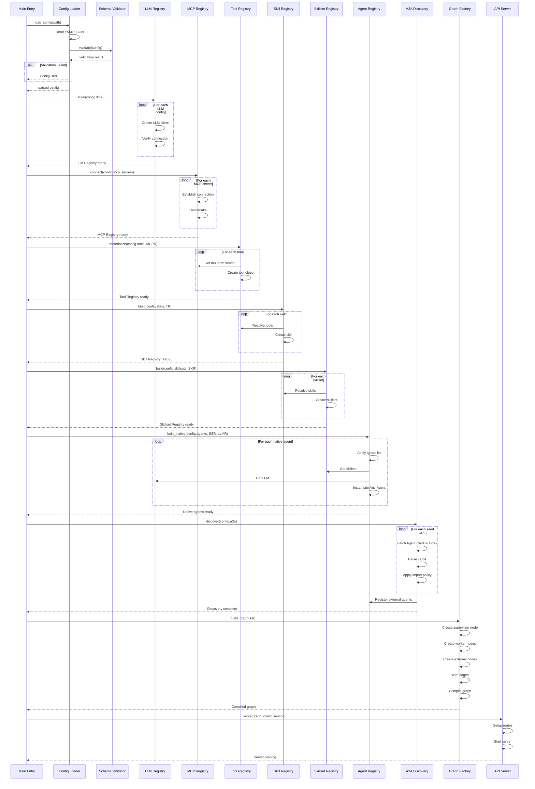

---

## D35: Native Worker Path Sequence

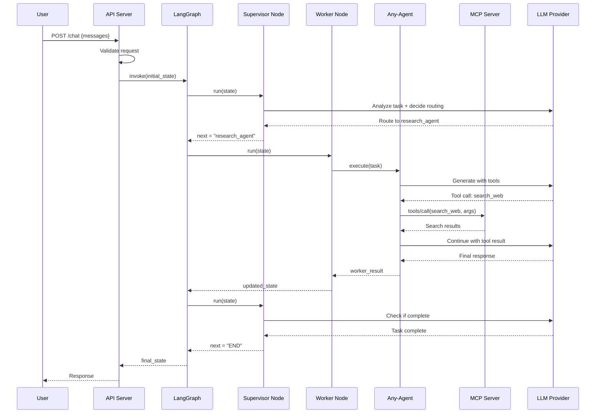

---

## D36: External Agent Path Sequence

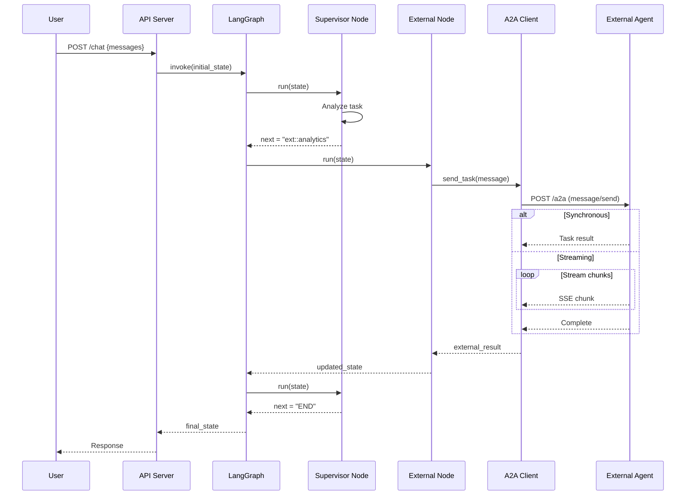

---

## D37: tools_only Mode Sequence

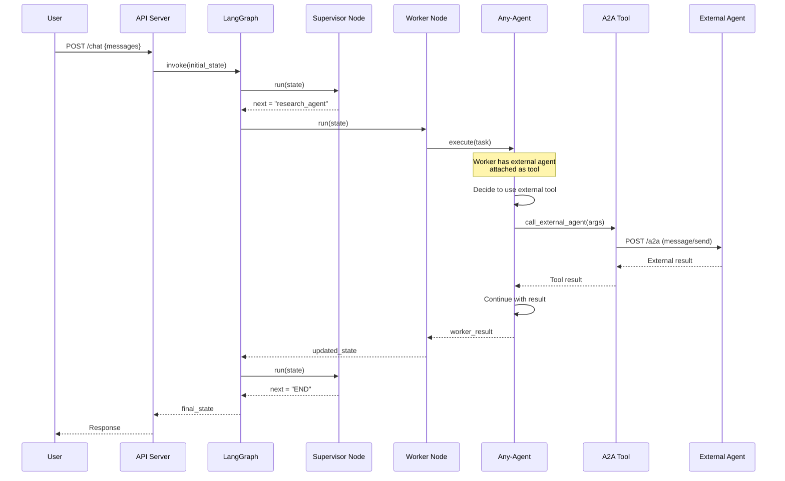

---

## D38: Human-in-the-Loop Sequence

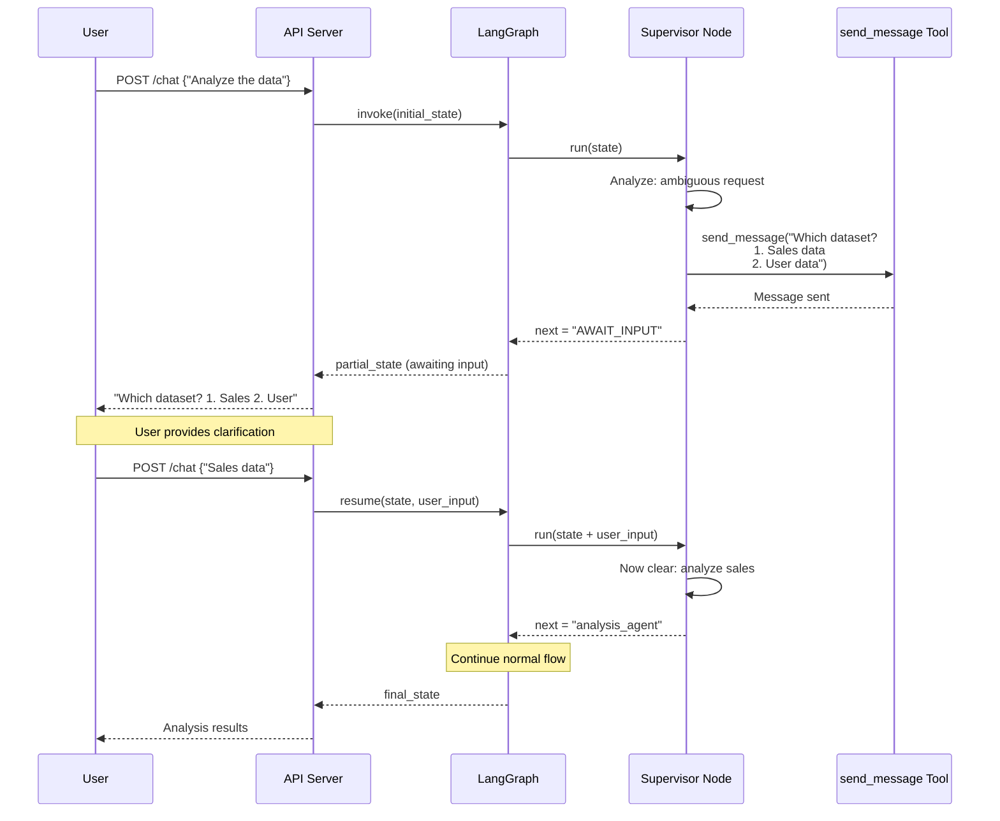

---

## D39: A2A Discovery (Host Index) Sequence

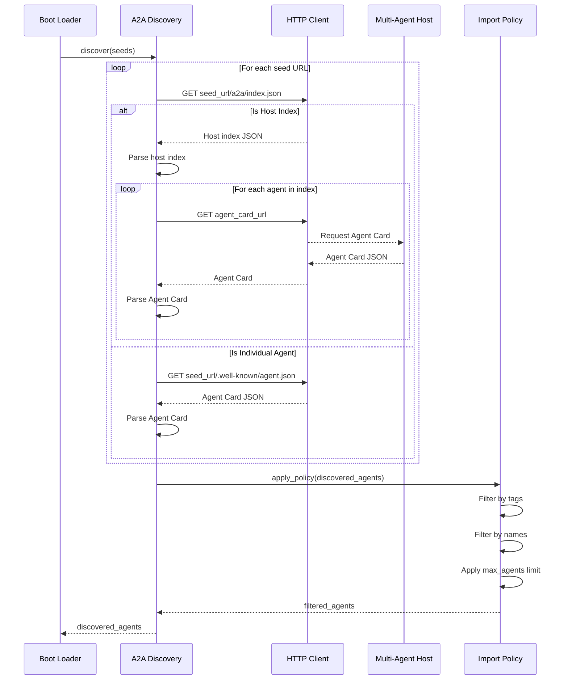

---

## D40: A2A Discovery (Individual) Sequence

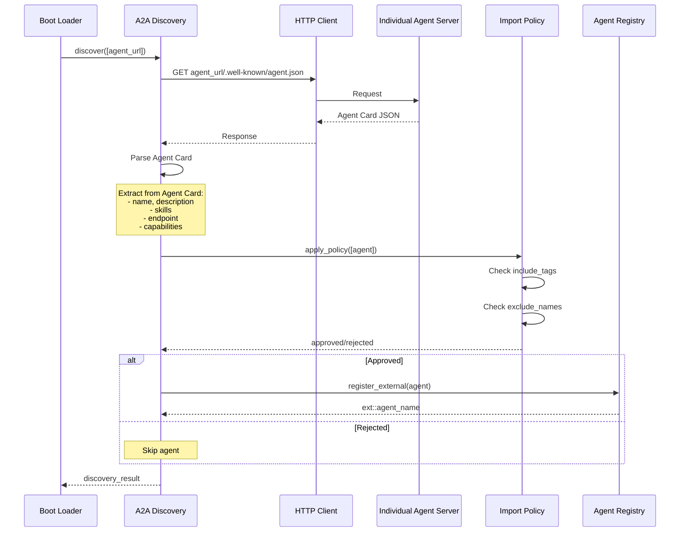

---

## D41: Streaming Pass-through Sequence

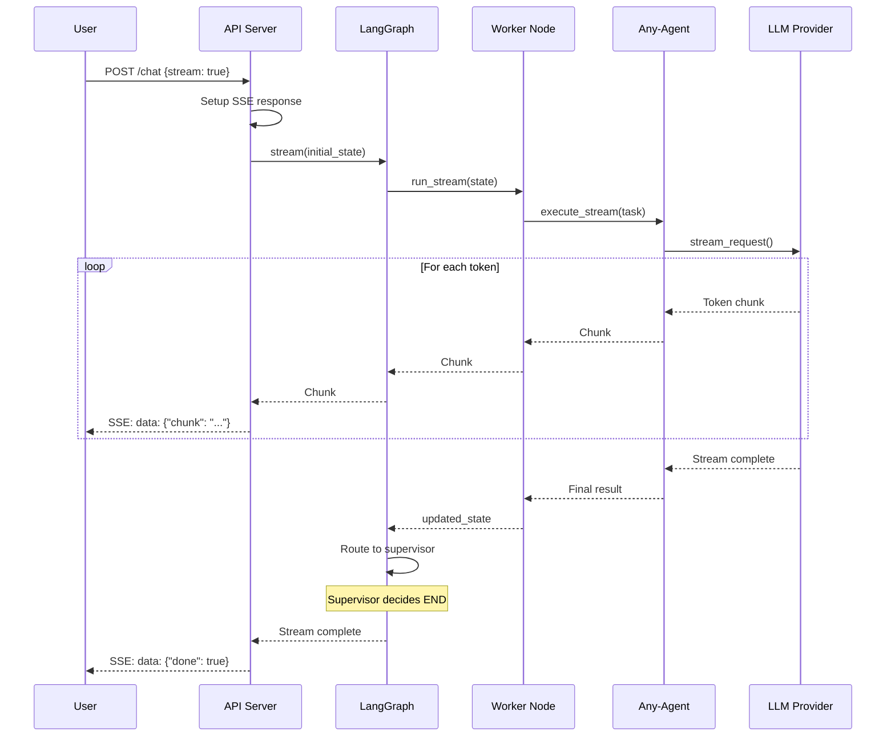

---

## D42: Timeout and Error Handling Sequence

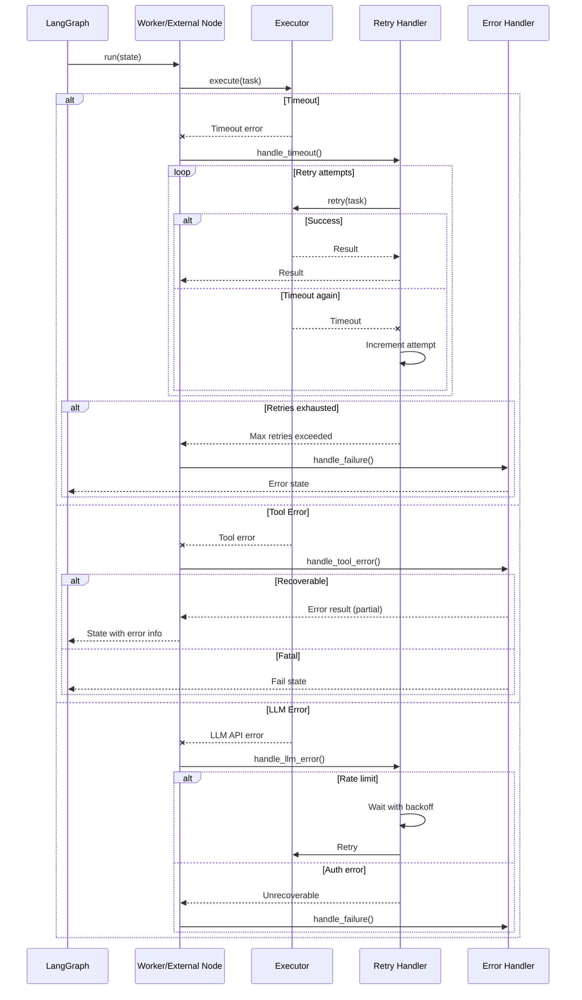

---

## D43: Supervisor Routing Loop State Machine

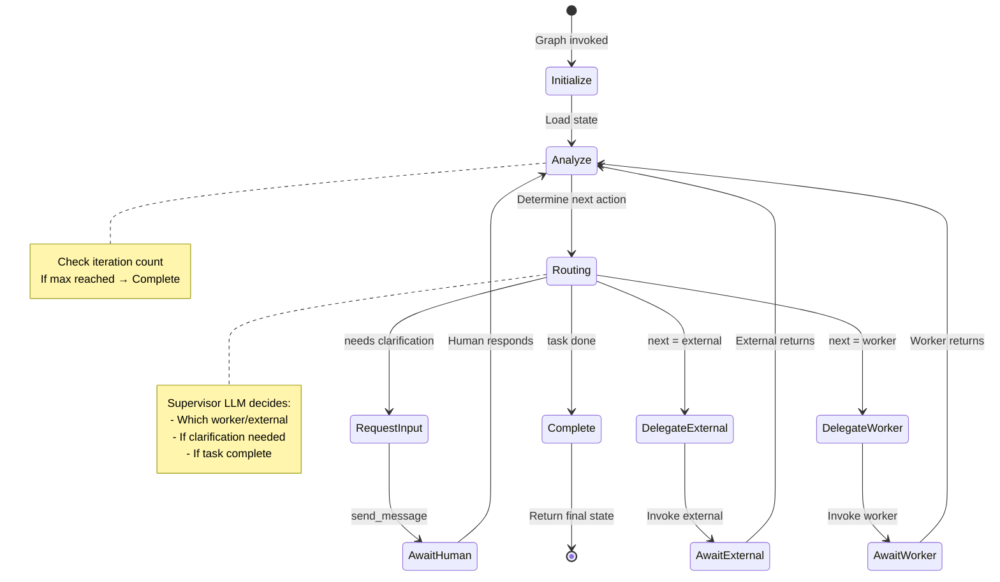

---

## D44: Task Lifecycle State Machine

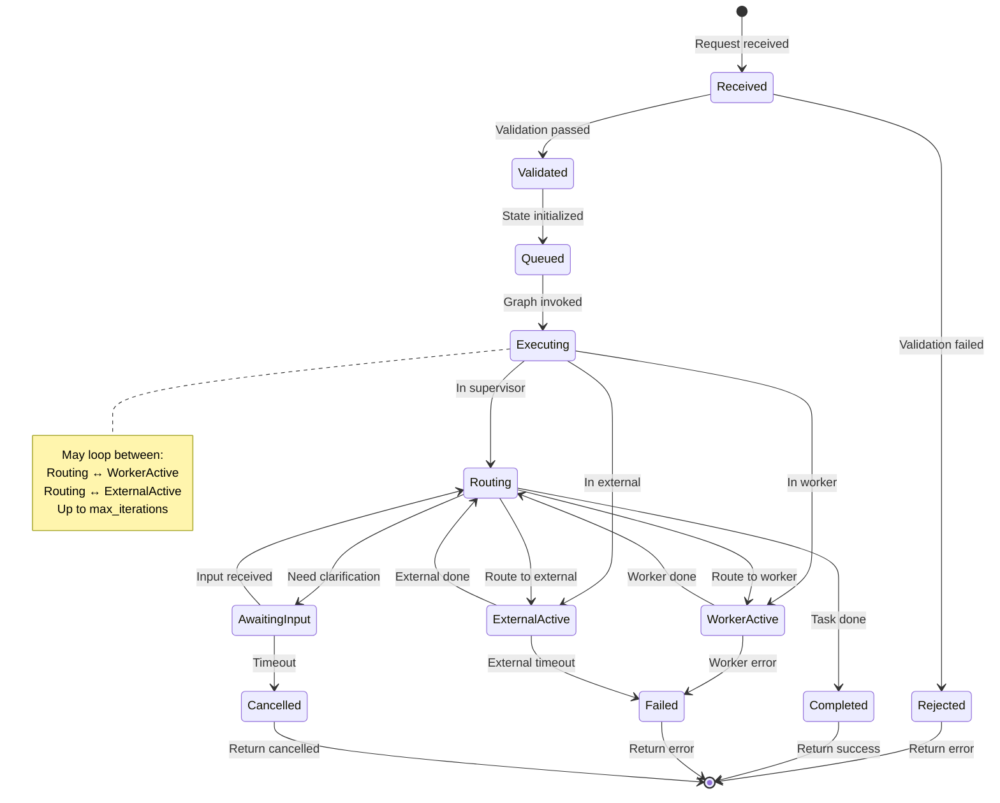

---

## Summary: Diagram Count

| Doc ID | Diagram Type | Count |
|--------|--------------|-------|
| D34 | sequenceDiagram | 1 |
| D35 | sequenceDiagram | 1 |
| D36 | sequenceDiagram | 1 |
| D37 | sequenceDiagram | 1 |
| D38 | sequenceDiagram | 1 |
| D39 | sequenceDiagram | 1 |
| D40 | sequenceDiagram | 1 |
| D41 | sequenceDiagram | 1 |
| D42 | sequenceDiagram | 1 |
| D43 | stateDiagram-v2 | 1 |
| D44 | stateDiagram-v2 | 1 |
| **Total** | | **11** |

---

## Related Documents

- D06: Component Overview
- D07: Data Flow Architecture
- D08: Integration Architecture
- D45-D50: Data Models

---

## Revision History

| Version | Date | Author | Changes |
|---------|------|--------|---------|
| 1.0 | Jan 2026 | Architecture Team | Initial draft |
