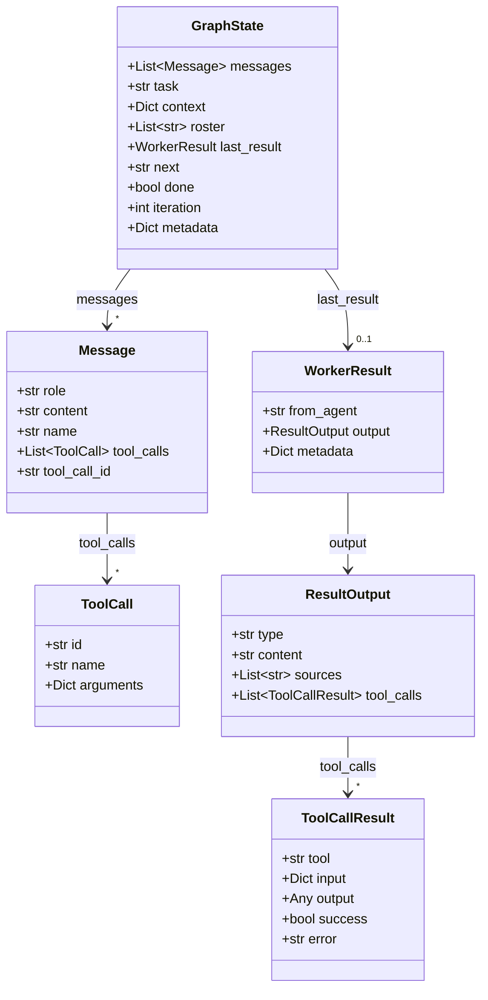
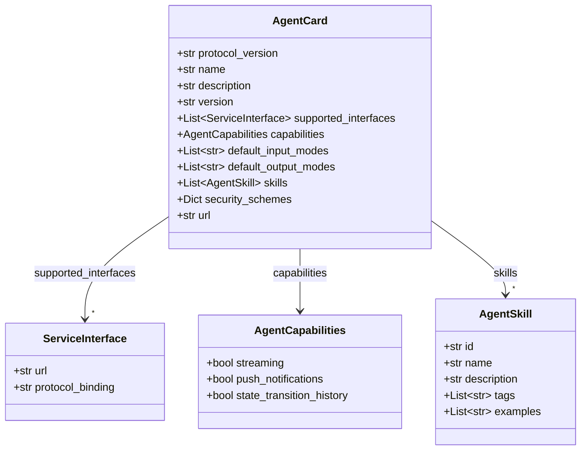
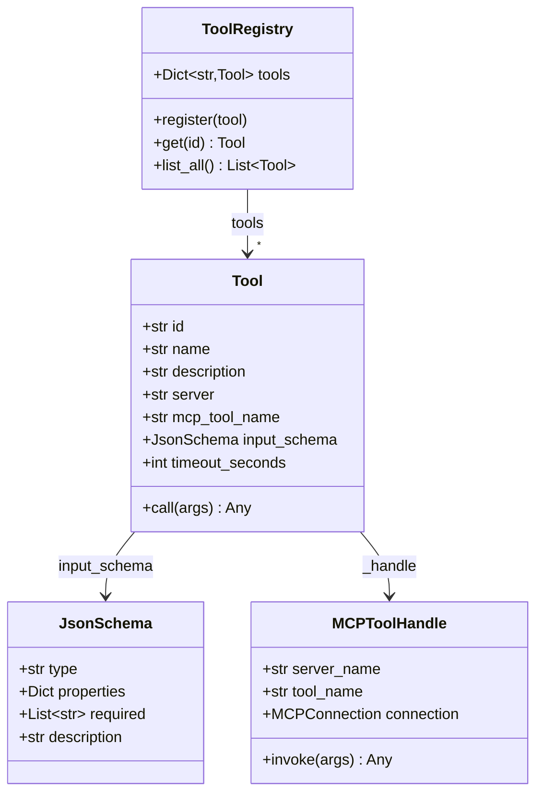
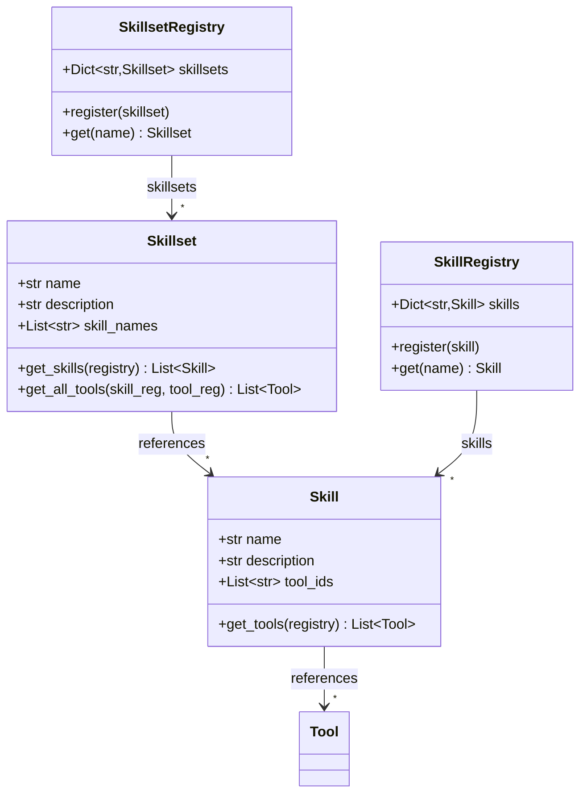
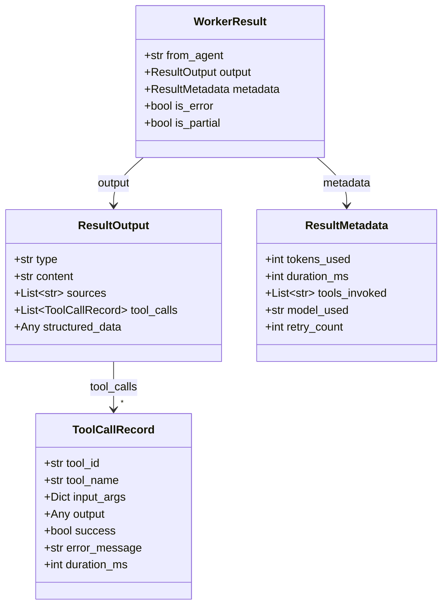
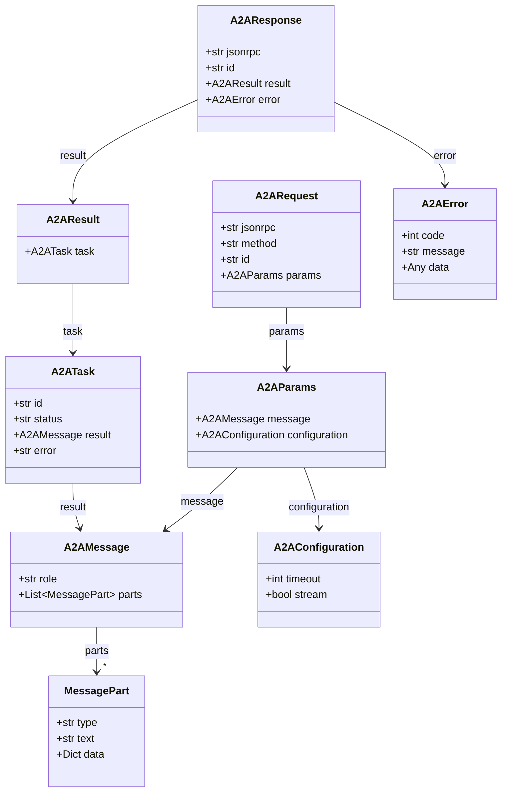

# D45-D50: Data Models

## Config-Driven Multi-Agent Orchestration System

**Document ID:** D45-D50  
**Version:** 1.0  
**Status:** Draft  
**Last Updated:** January 2026

---

## Document Index

| Doc ID | Model | Description |
|--------|-------|-------------|
| D45 | LangGraph State Schema | TypedDict for graph state |
| D46 | Agent Card Data Model | Parsed A2A Agent Card |
| D47 | Tool Definition Model | Internal tool representation |
| D48 | Skill/Skillset Models | Skill and skillset structures |
| D49 | Worker Result Model | Standardized worker output |
| D50 | A2A Request/Response Models | JSON-RPC message structures |

---

## D45: LangGraph State Schema

### Class Diagram



### Pydantic Implementation

```python
from typing import Annotated, Any, List, Optional, Dict
from typing_extensions import TypedDict
from pydantic import BaseModel, Field
from langgraph.graph.message import add_messages

class ToolCall(BaseModel):
    """A tool call made by the LLM."""
    id: str
    name: str
    arguments: Dict[str, Any]

class Message(BaseModel):
    """A message in the conversation."""
    role: str  # "user", "assistant", "system", "tool"
    content: str
    name: Optional[str] = None
    tool_calls: Optional[List[ToolCall]] = None
    tool_call_id: Optional[str] = None

class ToolCallResult(BaseModel):
    """Result of a single tool invocation."""
    tool: str
    input: Dict[str, Any]
    output: Any
    success: bool = True
    error: Optional[str] = None

class ResultOutput(BaseModel):
    """Structured output from a worker."""
    type: str  # "text", "error", "partial"
    content: str
    sources: List[str] = Field(default_factory=list)
    tool_calls: List[ToolCallResult] = Field(default_factory=list)

class WorkerResult(BaseModel):
    """Result returned by a worker agent."""
    from_agent: str
    output: ResultOutput
    metadata: Dict[str, Any] = Field(default_factory=dict)

class GraphState(TypedDict):
    """LangGraph state schema with reducers."""
    messages: Annotated[List[Message], add_messages]
    task: str
    context: Dict[str, Any]
    roster: List[str]
    last_result: Optional[WorkerResult]
    next: Optional[str]
    done: bool
    iteration: int
    metadata: Dict[str, Any]
```

### State Reducer Behavior

| Field | Reducer | Update Behavior |
|-------|---------|-----------------|
| `messages` | `add_messages` | Appends new messages |
| `task` | Replace | Overwrites |
| `context` | Replace | Overwrites (use merge in node) |
| `roster` | Replace | Overwrites |
| `last_result` | Replace | Overwrites |
| `next` | Replace | Overwrites |
| `done` | Replace | Overwrites |
| `iteration` | Replace | Increment in node |
| `metadata` | Replace | Overwrites |

---

## D46: Agent Card Data Model

### Class Diagram



### Pydantic Implementation

```python
from typing import List, Optional, Dict, Any
from pydantic import BaseModel, Field, HttpUrl

class ServiceInterface(BaseModel):
    """A2A service interface definition."""
    url: HttpUrl
    protocol_binding: str = "JSONRPC"

class AgentCapabilities(BaseModel):
    """Agent capability flags."""
    streaming: bool = False
    push_notifications: bool = False
    state_transition_history: bool = False

class AgentSkill(BaseModel):
    """A skill exposed by the agent."""
    id: str
    name: str
    description: str
    tags: List[str] = Field(default_factory=list)
    examples: List[str] = Field(default_factory=list)

class SecurityScheme(BaseModel):
    """Authentication scheme definition."""
    type: str  # "bearer", "apiKey", "oauth2"
    scheme: Optional[str] = None
    bearer_format: Optional[str] = None
    name: Optional[str] = None
    in_location: Optional[str] = None  # "header", "query"

class AgentCard(BaseModel):
    """Parsed A2A Agent Card from /.well-known/agent.json."""
    protocol_version: str = "1.0"
    name: str
    description: str
    version: str = "1.0.0"
    supported_interfaces: List[ServiceInterface] = Field(default_factory=list)
    capabilities: AgentCapabilities = Field(default_factory=AgentCapabilities)
    default_input_modes: List[str] = Field(default=["text/plain"])
    default_output_modes: List[str] = Field(default=["text/plain"])
    skills: List[AgentSkill] = Field(default_factory=list)
    security_schemes: Dict[str, SecurityScheme] = Field(default_factory=dict)
    
    # Internal fields (not from JSON)
    url: Optional[str] = None  # Source URL of the agent card

    @property
    def endpoint(self) -> Optional[str]:
        """Get primary endpoint URL."""
        if self.supported_interfaces:
            return str(self.supported_interfaces[0].url)
        return None

    @property
    def skill_names(self) -> List[str]:
        """Get list of skill names for matching."""
        return [skill.name for skill in self.skills]

    @property
    def all_tags(self) -> List[str]:
        """Get all unique tags across skills."""
        tags = set()
        for skill in self.skills:
            tags.update(skill.tags)
        return list(tags)
```

---

## D47: Tool Definition Model

### Class Diagram



### Pydantic Implementation

```python
from typing import Any, Callable, Dict, List, Optional
from pydantic import BaseModel, Field

class JsonSchema(BaseModel):
    """JSON Schema for tool input validation."""
    type: str = "object"
    properties: Dict[str, Any] = Field(default_factory=dict)
    required: List[str] = Field(default_factory=list)
    description: Optional[str] = None

class Tool(BaseModel):
    """Internal representation of a callable tool."""
    id: str  # Unique tool ID in registry
    name: str  # Display name
    description: str
    server: str  # MCP server name
    mcp_tool_name: str  # Tool name in MCP server
    input_schema: JsonSchema
    timeout_seconds: int = 30
    
    # Runtime handle (not serialized)
    _handle: Any = None

    class Config:
        arbitrary_types_allowed = True
        underscore_attrs_are_private = True

    async def call(self, arguments: Dict[str, Any]) -> Any:
        """Invoke the tool with given arguments."""
        if self._handle is None:
            raise RuntimeError(f"Tool {self.id} not connected")
        return await self._handle.invoke(arguments)

class ToolRegistry(BaseModel):
    """Registry of all available tools."""
    tools: Dict[str, Tool] = Field(default_factory=dict)

    def register(self, tool: Tool) -> None:
        """Register a tool."""
        self.tools[tool.id] = tool

    def get(self, tool_id: str) -> Optional[Tool]:
        """Get a tool by ID."""
        return self.tools.get(tool_id)

    def list_all(self) -> List[Tool]:
        """List all registered tools."""
        return list(self.tools.values())

    def list_by_server(self, server: str) -> List[Tool]:
        """List tools from a specific MCP server."""
        return [t for t in self.tools.values() if t.server == server]
```

---

## D48: Skill and Skillset Models

### Class Diagram



### Pydantic Implementation

```python
from typing import Dict, List, Optional
from pydantic import BaseModel, Field

class Skill(BaseModel):
    """A skill groups related tools."""
    name: str
    description: str = ""
    tool_ids: List[str] = Field(default_factory=list)

    def get_tools(self, tool_registry: "ToolRegistry") -> List["Tool"]:
        """Resolve tool IDs to Tool objects."""
        tools = []
        for tool_id in self.tool_ids:
            tool = tool_registry.get(tool_id)
            if tool:
                tools.append(tool)
        return tools

class Skillset(BaseModel):
    """A skillset groups related skills for an agent."""
    name: str
    description: str = ""
    skill_names: List[str] = Field(default_factory=list)

    def get_skills(self, skill_registry: "SkillRegistry") -> List[Skill]:
        """Resolve skill names to Skill objects."""
        skills = []
        for skill_name in self.skill_names:
            skill = skill_registry.get(skill_name)
            if skill:
                skills.append(skill)
        return skills

    def get_all_tools(
        self, 
        skill_registry: "SkillRegistry", 
        tool_registry: "ToolRegistry"
    ) -> List["Tool"]:
        """Get all tools across all skills in this skillset."""
        tools = []
        seen_ids = set()
        for skill in self.get_skills(skill_registry):
            for tool in skill.get_tools(tool_registry):
                if tool.id not in seen_ids:
                    tools.append(tool)
                    seen_ids.add(tool.id)
        return tools

class SkillRegistry(BaseModel):
    """Registry of all skills."""
    skills: Dict[str, Skill] = Field(default_factory=dict)

    def register(self, skill: Skill) -> None:
        self.skills[skill.name] = skill

    def get(self, name: str) -> Optional[Skill]:
        return self.skills.get(name)

    def list_all(self) -> List[Skill]:
        return list(self.skills.values())

class SkillsetRegistry(BaseModel):
    """Registry of all skillsets."""
    skillsets: Dict[str, Skillset] = Field(default_factory=dict)

    def register(self, skillset: Skillset) -> None:
        self.skillsets[skillset.name] = skillset

    def get(self, name: str) -> Optional[Skillset]:
        return self.skillsets.get(name)

    def list_all(self) -> List[Skillset]:
        return list(self.skillsets.values())
```

---

## D49: Worker Result Model

### Class Diagram



### Pydantic Implementation

```python
from typing import Any, Dict, List, Optional
from pydantic import BaseModel, Field
from enum import Enum

class ResultType(str, Enum):
    """Type of result output."""
    TEXT = "text"
    ERROR = "error"
    PARTIAL = "partial"
    STRUCTURED = "structured"

class ToolCallRecord(BaseModel):
    """Record of a tool invocation during worker execution."""
    tool_id: str
    tool_name: str
    input_args: Dict[str, Any]
    output: Any
    success: bool = True
    error_message: Optional[str] = None
    duration_ms: int = 0

class ResultOutput(BaseModel):
    """Structured output from worker execution."""
    type: ResultType = ResultType.TEXT
    content: str
    sources: List[str] = Field(default_factory=list)
    tool_calls: List[ToolCallRecord] = Field(default_factory=list)
    structured_data: Optional[Dict[str, Any]] = None

class ResultMetadata(BaseModel):
    """Metadata about the worker execution."""
    tokens_used: int = 0
    duration_ms: int = 0
    tools_invoked: List[str] = Field(default_factory=list)
    model_used: Optional[str] = None
    retry_count: int = 0

class WorkerResult(BaseModel):
    """Complete result from a worker agent execution."""
    from_agent: str
    output: ResultOutput
    metadata: ResultMetadata = Field(default_factory=ResultMetadata)

    @property
    def is_error(self) -> bool:
        """Check if result represents an error."""
        return self.output.type == ResultType.ERROR

    @property
    def is_partial(self) -> bool:
        """Check if result is partial (incomplete)."""
        return self.output.type == ResultType.PARTIAL

    @property
    def content(self) -> str:
        """Shortcut to output content."""
        return self.output.content

    def to_message(self) -> Dict[str, Any]:
        """Convert to message format for graph state."""
        return {
            "role": "assistant",
            "name": self.from_agent,
            "content": self.output.content
        }
```

---

## D50: A2A Request/Response Models

### Class Diagram



### Pydantic Implementation

```python
from typing import Any, Dict, List, Optional, Union
from pydantic import BaseModel, Field
from enum import Enum

class TaskStatus(str, Enum):
    """A2A task status values."""
    SUBMITTED = "SUBMITTED"
    WORKING = "WORKING"
    COMPLETED = "COMPLETED"
    FAILED = "FAILED"
    CANCELLED = "CANCELLED"
    INPUT_REQUIRED = "INPUT_REQUIRED"

class MessagePart(BaseModel):
    """A part of an A2A message."""
    type: str  # "text", "data", "file"
    text: Optional[str] = None
    data: Optional[Dict[str, Any]] = None
    mime_type: Optional[str] = None

class A2AMessage(BaseModel):
    """An A2A protocol message."""
    role: str  # "user", "agent"
    parts: List[MessagePart] = Field(default_factory=list)

    @classmethod
    def from_text(cls, role: str, text: str) -> "A2AMessage":
        """Create a simple text message."""
        return cls(role=role, parts=[MessagePart(type="text", text=text)])

    def get_text(self) -> str:
        """Extract text content from parts."""
        texts = [p.text for p in self.parts if p.type == "text" and p.text]
        return "\n".join(texts)

class A2AConfiguration(BaseModel):
    """Configuration for an A2A request."""
    timeout: int = 40
    stream: bool = False
    accepted_output_modes: List[str] = Field(default=["text/plain"])

class A2AParams(BaseModel):
    """Parameters for message/send method."""
    message: A2AMessage
    configuration: A2AConfiguration = Field(default_factory=A2AConfiguration)

class A2ARequest(BaseModel):
    """A2A JSON-RPC 2.0 request."""
    jsonrpc: str = "2.0"
    method: str  # "message/send", "message/stream", "tasks/get"
    id: str
    params: A2AParams

class A2ATask(BaseModel):
    """An A2A task with status and result."""
    id: str
    status: TaskStatus
    result: Optional[A2AMessage] = None
    error: Optional[str] = None

class A2AResult(BaseModel):
    """Result of an A2A operation."""
    task: A2ATask

class A2AError(BaseModel):
    """A2A JSON-RPC error."""
    code: int
    message: str
    data: Optional[Any] = None

class A2AResponse(BaseModel):
    """A2A JSON-RPC 2.0 response."""
    jsonrpc: str = "2.0"
    id: str
    result: Optional[A2AResult] = None
    error: Optional[A2AError] = None

    @property
    def is_success(self) -> bool:
        """Check if response is successful."""
        return self.error is None and self.result is not None

    @property
    def is_complete(self) -> bool:
        """Check if task is complete."""
        return (
            self.result is not None 
            and self.result.task.status == TaskStatus.COMPLETED
        )

    def get_content(self) -> Optional[str]:
        """Extract text content from successful response."""
        if self.result and self.result.task.result:
            return self.result.task.result.get_text()
        return None

# Factory functions for creating requests
def create_send_message_request(
    message: str,
    request_id: str,
    timeout: int = 40,
    stream: bool = False
) -> A2ARequest:
    """Create a message/send request."""
    return A2ARequest(
        method="message/send",
        id=request_id,
        params=A2AParams(
            message=A2AMessage.from_text("user", message),
            configuration=A2AConfiguration(timeout=timeout, stream=stream)
        )
    )

def create_get_task_request(task_id: str, request_id: str) -> Dict[str, Any]:
    """Create a tasks/get request."""
    return {
        "jsonrpc": "2.0",
        "method": "tasks/get",
        "id": request_id,
        "params": {"taskId": task_id}
    }
```

---

## Summary: Models and Diagrams

| Doc ID | Model | Class Diagram | Pydantic Classes |
|--------|-------|---------------|------------------|
| D45 | LangGraph State | ✅ | 6 classes |
| D46 | Agent Card | ✅ | 5 classes |
| D47 | Tool Definition | ✅ | 4 classes |
| D48 | Skill/Skillset | ✅ | 4 classes |
| D49 | Worker Result | ✅ | 5 classes |
| D50 | A2A Request/Response | ✅ | 10 classes |
| **Total** | | **6 diagrams** | **34 classes** |

---

## Related Documents

- D06: Component Overview
- D07: Data Flow Architecture
- D25: Master Config Schema
- D34-D44: Sequence Diagrams

---

## Revision History

| Version | Date | Author | Changes |
|---------|------|--------|---------|
| 1.0 | Jan 2026 | Architecture Team | Initial draft |
